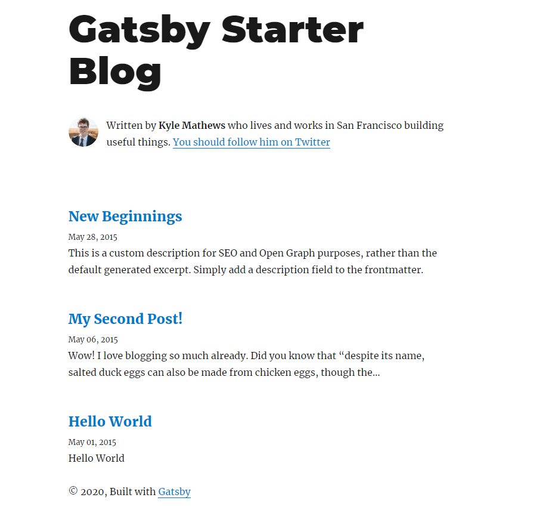
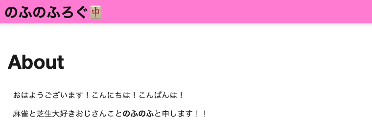
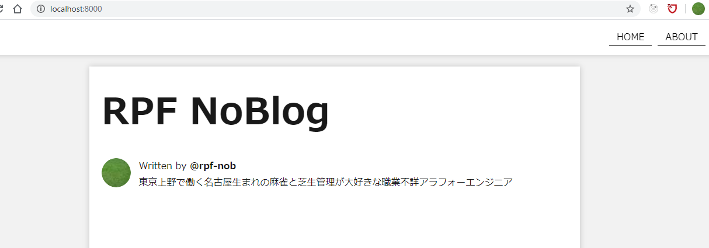

## はじめに 

このブログはGatsbyJSで作成していますが、[gatsby-starter-blog](https://gatsby-starter-blog-demo.netlify.app/)のテンプレートから作成しているので、
結構見た目は普通な感じだし、ナビゲーションバーとかAboutページとかタグページとかの機能もなく最低限しかないんですよね。
なので、少しずつ見た目や機能を改善していけたらと思っています！まあ、もともとReactやGraphQLなどの勉強のために最低限の機能のテンプレートにしようと思ってたんですけどね。

で、今回はAboutページとそこに遷移するためのナビゲーションバーを作成したので、実装した部分を書いていきたいと思います。



## 新しいページを作る方法

すげー簡単です。[src/pages]ディレクトリに追加したいページのコンポーネントを作成したファイルを追加するだけでした。
これはGatsbyJSのもともとの機能なのですが、AboutページとかContactページとかの固定ページはこちらの方法でページ作成するといいです。

他にもプログラムでページを作成することもできるので、こちらはタグページの追加時にまた書いていければと思います。

## src/pages/about.jsを作成する

```javascript:title=src/pages/about.js
import React from "react";
import { Link, graphql } from "gatsby";

import Layout from "../components/layout";
import SEO from "../components/seo";
import image from "../images/about.png";

const Aboutpage = ({ data, location }) => {
  const siteTitle = data.site.siteMetadata.title;
  const author = data.site.siteMetadata.author.name;
  return (
    <div>
      <Layout location={location} title={siteTitle} author={author}>
        <SEO title="About" />
        <h1>About</h1>
      </Layout>
    </div>
  );
};

export default Aboutpage;

export const pageQuery = graphql`
  query {
    site {
      siteMetadata {
        title
        author {
          name
        }
      }
    }
  }
`;

```

これだけでAboutページが作成できましたので、[localhost:8000/about]に移動して確認すると問題なくできていますね！！
あとは、内容を書いていけばページは完成です。



## ナビゲーションバーを作成する

Aboutページができたので、こちらにジャンプできるようにリンクが必要なので、ナビゲーションバーを上部に作って、そこからジャンプできるようにしたいと思います。

### ナビゲーションバーコンポーネントを作成する

まずナビゲーションバーのコンポーネントを作成します。

今回は[Home]と[About]の二つの遷移だけ作りました。（今後コンタクトページとかタグページなどのリンクを増やしていく予定です。）

[src/components/navbar.js]を新規作成して、[src/styles/style.scss]に以下追記します。

```javascript:title=src/components/navbar.js
import React from "react";
import { Link } from "gatsby";

const NavBar = () => {
  return (
    <nav className="navbar">
      <ul className="navbar__ul">
        <li className="navbar__li">
          <Link to="/">HOME</Link>
        </li>
        <li className="navbar__li">
          <Link to="/about">ABOUT</Link>
        </li>
      </ul>
    </nav>
  );
};

export default NavBar;
```
```scss:title=src/styles/style.scss
.navbar {
  position: fixed;
  padding: 0;
  margin: 0;
  margin-bottom: 10px;
  background: white;
  height: 60px;
  width: 100%;
  top: 0;
  left: 0;
  z-index: 1000;
  box-shadow: 0 0 10px rgba(0, 0, 0, 0.2);

  &__ul {
    float: right;
    margin-right: 20px;
  }
  &__li {
    display: inline-block;
    line-height: 60px;
    margin: 0 5px;

    & a {
      color: black;
      padding: 7px 13px;
      padding-bottom: 1px;
      transition: all 0.5s ease;

      &:hover {
        color: red;
        transition: 0.5s;
      }
    }
  }
}
```

<br>

### 作ったナビゲーションバーコンポーネントをレイアウトコンポーネントに追加する

ナビゲーションバーはすべてのページに設置したいので、[src/components/layout.js]の[Layout]コンポーネントに↑で作った[NavBar]コンポーネントを設置します。
[NavBar]コンポーネントは画面の上部に固定しているので、marginTopを少し大きくとるように修正しました。

```javascript{18}:title=src/components/layout.js
import NavBar from "../components/navbar";

const Layout = ({ location, title, author, children }) => {

  // 省略
  return (
    <div
      style={{
        marginLeft: `auto`,
        marginRight: `auto`,
        marginTop: 80,
        maxWidth: rhythm(30),
        padding: `${rhythm(1.5)} ${rhythm(3 / 4)}`,
        backgroundColor: `#fff`,
        boxShadow: `0 0 10px rgba(0,0,0,0.2)`,
      }}
    >
      <NavBar />
      <header>{header}</header>
      <main>{children}</main>
      <footer>
        ©2020 {author} All Rights Reserved.
      </footer>
    </div>
  );
};
```

これで全てのページで以下のようにナビゲーションバーが表示できたはずです。



## まとめ

今回はAboutページとそこに遷移するためのナビゲーションバーを作成しました。<br>
このあたりはそれほど難しくなく簡単にできますね。


