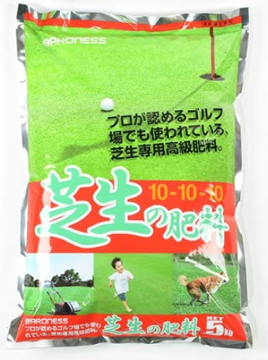
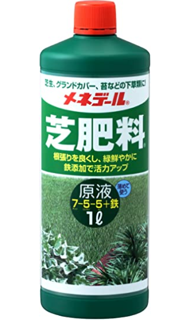

## はじめに 

暖かくなってきて本格的に芝生シーズンが始まりましたね。今回は自分があげている肥料を紹介します。

自身3年目の芝生シーズンで芝生管理に関してはまだまだ初心者で勉強中なのですが、
去年は今回紹介する二つを使っていたら、プロが管理する芝生と同じくらい（いいすぎではない）の緑が濃くてきれいになりました。

なので、自信を持って紹介していきます！！

* なぜ芝生に肥料が必要なのか？
* おすすめ１
* おすすめ２
* まとめ

## なぜ芝生に肥料が必要なのか？

まず最初に、なぜ芝生に肥料が必要なのかということですが、まあ普通に考えて野菜とかと同じで、成長を促すために肥料は必須です。
芝生は発芽が始まる3月～11月くらいまでは、肥料を与えてやる必要があります。肥料なしでは緑が濃くて密な芝生は育たないです。

## おすすめ１ バロネス 芝生の肥料

一つ目は[バロネス 芝生の肥料](https://www.amazon.co.jp/dp/B0031VJP5Q)です。

細粒タイプの化成肥料で、施肥直後から長期にわたり肥効が持続し、かつ肥料焼けも少なく、初心者にも安心して使用できます。

[公式ホームページ](http://www.baroness-direct.com/fs/baroness/040308)にもありますが、
**すぐ緑が濃くなり、驚くほど緑がきれいになるので、本当に「この肥料しか使いません。」と自分も思ってしまいました。**
もう、他の細粒タイプの化成肥料を探すことも今後ないでしょうね。そう思えるくらい良い肥料です。
5kgで3680円と少し高めなのですが、費用対効果はものすごく高いのでおすすめです。

## おすすめ２　メネデール 芝肥料 原液

二つ目は[メネデール 芝肥料 原液 1L](https://www.amazon.co.jp/dp/B00337XS6K)です。

こちらは液体タイプと肥料です。液体タイプは即効性の高いので重宝しています。
基本はバロネスの芝生の肥料を施肥するのですが、もう少し成長させたいとか、ちょっと弱っているかなと思ったところに
こちらの液体肥料を施肥します。1～2週間くらいしか効果は持続しませんが、**即効性が高いのですぐに青々としてきます。**

## まとめ

今回は芝生にあげるとめちゃくちゃ緑が濃くなる肥料を紹介しました！！

今シーズンもこの二つの肥料で青々と芝生が育つのが楽しみです。青々としてきたらブログにもどんどん画像をアップしていきたいと思います。