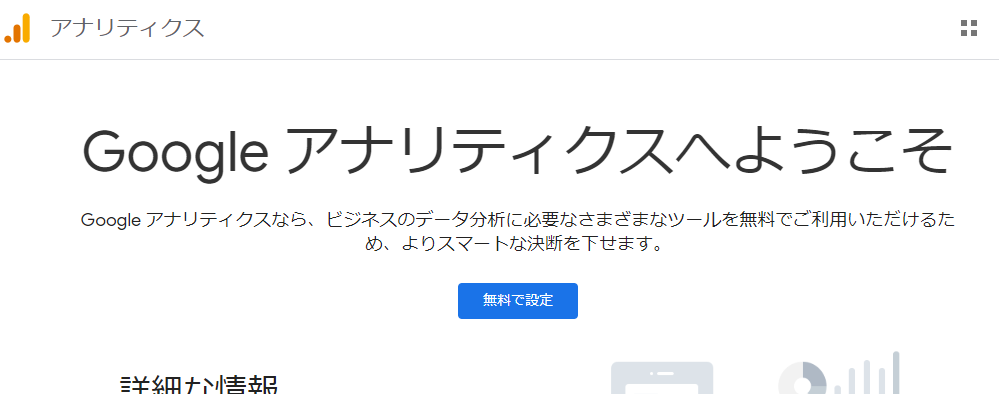
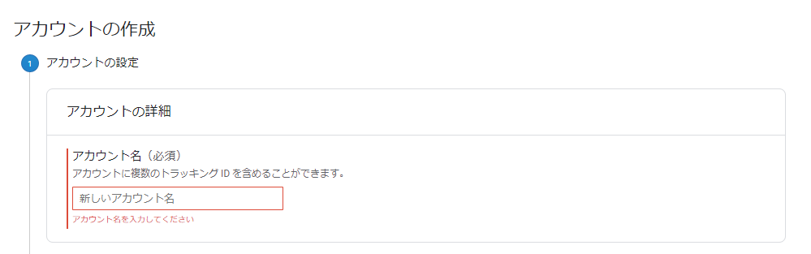
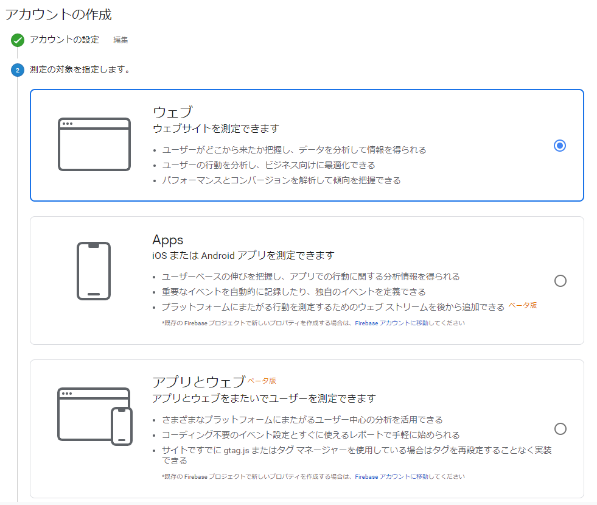
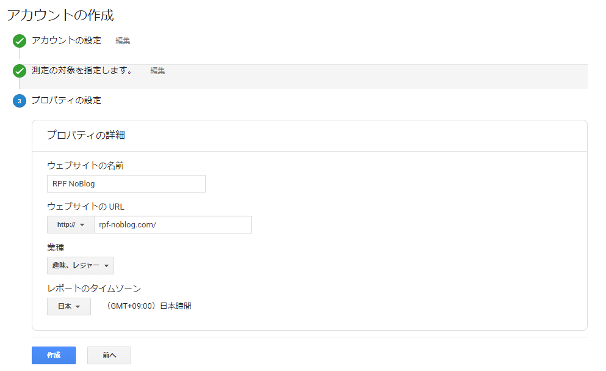
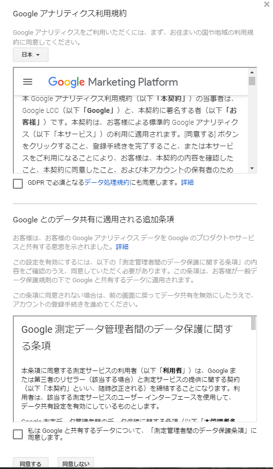
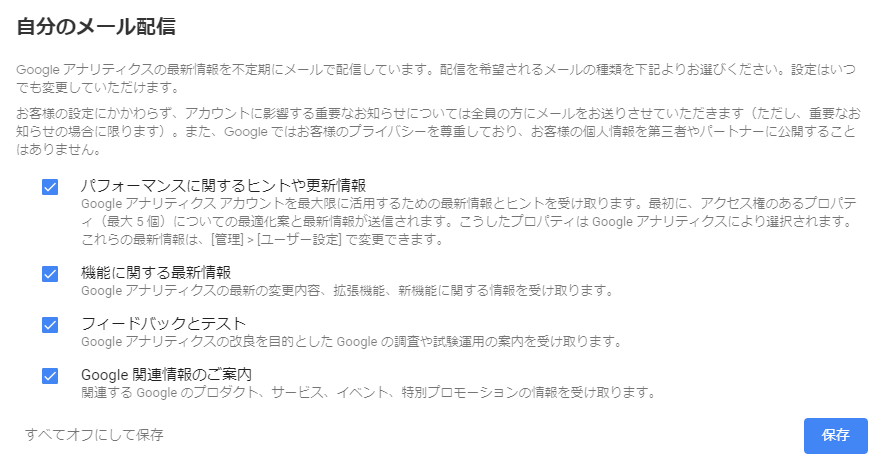

## はじめに 

おはようございます！こんにちは！こんばんは！<br>
麻雀と芝生大好きおじさんこと**のふのふ**(@rpf_nob)です！！

今回はGatsbyJSブログにGoogleAnalyticsを導入して、訪問者数などの情報を取得してみたいと思います。<br>
せっかくブログやるなら訪問者数とか意識していきたいですよね。

基本的には[公式ページ](https://www.gatsbyjs.org/docs/adding-analytics/)の内容通りやればできます。

<div class="iframely-embed"><div class="iframely-responsive" style="height: 140px; padding-bottom: 0;"><a href="https://www.gatsbyjs.org/docs/adding-analytics/" data-iframely-url="//cdn.iframe.ly/txCWXWK"></a></div></div>

## 前提

このブログはGatsbyJSの[gatsby-starter-blog](https://www.gatsbyjs.org/starters/gatsbyjs/gatsby-starter-blog/)のテンプレートから作成しています。

<div class="iframely-embed"><div class="iframely-responsive" style="height: 140px; padding-bottom: 0;"><a href="https://www.gatsbyjs.org/starters/gatsbyjs/gatsby-starter-blog/" data-iframely-url="//cdn.iframe.ly/qjUJkBu?iframe=card-small"></a></div></div>

## GoogleAnalyticsのセットアップ

### GoogleAnalyticsのサイトへアクセス

[GooglaAnalyticsのサイト](https://analytics.google.com/)へアクセスすると以下のような画面になるので、[無料で設定]ボタンをクリックします。



### GoogleAnalyticsのアカウント作成

Googleアカウントにログインしている状態で、サイトにアクセスすると以下5ステップで設定していきます。

* アカウントの設定
* 測定の対象を指定する
* プロパティの設定
* 利用規約の同意
* GoogleAnalyticsの情報をメールに配信するかの設定

#### アカウントの設定

以下のような画面になるので、GoogleAnalyticsのアカウント名を設定します。<br>
一般的には、アカウント名は会社名をつけることが多いらしいけど、今回は個人ブログなので、ブログで使っている名前で設定しました。



#### 測定の対象を指定する

次に測定の対象を指定します。<br>
今回はブログなのでウェブを選択しました。



#### プロパティの設定

次にプロパティの設定をします。<br>
ウェブサイト名・URL・種類・タイムゾーンを設定していきます。



#### 利用規約の同意

日本の利用規約に変更して、チェックして同意します。



#### GoogleAnalyticsの情報をメールに配信するかの設定

GoogleAnalyticsの情報をメールに配信するかの設定ができます。<br>
こちらは後からも変更できるので、一旦全てチェックしました。



## Gatsbyの設定

次にページビューをGoogleAnalyticsアカウントに送信するようにGatsby側の設定をしていきます。

### プラグインのインストール

プラグインをインストールします。<br>
[gatsby-plugin-google-analytics]が必要なのですが、自分はもともとインストールされていたのでインストール不要でした。

```
npm install --save gatsby-plugin-google-analytics
```

### プラグインの適用

インストールしたら、[gatsby-config.js]にプラグインを追加します。<br>
こちらももともとほぼ記載されていたので、トラッキングIDを変更するだけでした。

```js:title=gatsby-config.js
module.exports = {
  plugins: [
    {
      resolve: `gatsby-plugin-google-analytics`,
      options: {
        // replace "UA-XXXXXXXXX-X" with your own Tracking ID
        trackingId: "UA-XXXXXXXXX-X",
      },
    },
  ],
}
```

### GoogleAnalyticsを確認する

これで適用できているはずなので、確認してみましょう。<br>
まだ、始めたばかりなのでアクティブユーザーが0人・・・頑張ります！！

## まとめ

今回はGoogleAnalyticsを導入しました。<br>
今後訪問者が増えていくように、いろいろ試行錯誤したいと思います！！

他にもGatsbyJSのブログカスタマイズをいろいろやっているので、以下もあわせてご覧いただければと思います。

<div class="iframely-embed"><div class="iframely-responsive" style="height: 140px; padding-bottom: 0;"><a href="https://rpf-noblog.com/tags/gatsby-js/" data-iframely-url="//cdn.iframe.ly/5j7eIPT"></a></div></div>


<br>
<br>

最後まで見ていただきありがとうございます！！