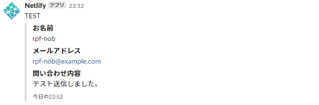

## はじめに 

おはようございます！こんにちは！こんばんは！<br>
麻雀と芝生大好きおじさんこと**のふのふ**(@rpf_nob)です！！

今回はGatsbyJSブログにNetlify Formsでお問い合わせページを追加します。<br>

基本的には[GatsbyJSの公式ページ](https://www.gatsbyjs.org/docs/building-a-contact-form/)と[netlifyのドキュメント](https://docs.netlify.com/forms/setup/)の内容通りやれば簡単にできるのでおススメです！

<div class="iframely-embed"><div class="iframely-responsive" style="height: 140px; padding-bottom: 0;"><a href="https://www.gatsbyjs.org/docs/building-a-contact-form/" data-iframely-url="//cdn.iframe.ly/ELouhRU"></a></div></div>

## 前提

このブログはGatsbyJSの[gatsby-starter-blog](https://www.gatsbyjs.org/starters/gatsbyjs/gatsby-starter-blog/)のテンプレートから作成しています。

<div class="iframely-embed"><div class="iframely-responsive" style="height: 140px; padding-bottom: 0;"><a href="https://www.gatsbyjs.org/starters/gatsbyjs/gatsby-starter-blog/" data-iframely-url="//cdn.iframe.ly/qjUJkBu?iframe=card-small"></a></div></div>

## Netlify Formsとは

### Netlifyとは
[Netlify](https://app.netlify.com/)は静的サイトをホスティングできるサービスで、このサイトはNetlifyを使用しています。<br>

### Netlify Formsとは
Netlify FormsはNetlifyのサービスの一つで、バックエンドの実装やフロントエンドのjavascriptのコードを書くことなく、問い合わせフォームが追加できます。<br>

### 価格

月100件・10MBまで無料で使用できるので、はじめのうちはこれで十分かと思います。

### その他機能

その他にもファイルアップロードやメールやSlackへの通知機能などもありかなり便利です。

## 問い合わせページ作成

それでは問い合わせページを作成していきます。

### src/pages/contact.jsを作成

今回はフォームに[material-ui]を使用したので、インストールします。

```
npm install --save @material-ui/core
```

名前・メール・件名・問い合わせ内容のテキストエリアと送信ボタンを用意します。<br>
送信ボタンにdisabled機能だけつけています。

```js:title=src/pages/contact.js
import React, { useState } from "react";
import { Link, graphql } from "gatsby";

import Layout from "../components/layout";
import SEO from "../components/seo";

import TextField from "@material-ui/core/TextField";
import Button from "@material-ui/core/Button";

const Contact = ({ data, location }) => {
  const siteTitle = data.site.siteMetadata.title;
  const author = data.site.siteMetadata.author.name;

  const [name, setName] = useState("");
  const [email, setEmail] = useState("");
  const [subject, setSubject] = useState("");
  const [message, setMessage] = useState("");

  const handleChange = event => {
    switch (event.target.name) {
      case "name":
        setName(event.target.value);
        break;
      case "email":
        setEmail(event.target.value);
        break;
      case "subject":
        setSubject(event.target.value);
        break;
      case "message":
        setMessage(event.target.value);
        break;
      default:
        console.log("key not found");
    }
  };

  const canSubmit = () => {
    if (name === "") return true;
    if (email === "") return true;
    if (subject === "") return true;
    if (message === "") return true;

    return false;
  };

  return (
    <div>
      <Layout location={location} title={siteTitle} author={author}>
        <SEO title="Contact" />
        <h1>Contact</h1>
        <p>
          各種お問い合わせはこちらのフォームよりお願いいたします。
          <br></br>
          お名前・メールアドレス・件名・問い合わせ内容を記載して送信ボタンをクリックしてください。
        </p>
        <div className="contact">
          <form
            name="contact"
            method="POST"
            data-netlify="true"
            data-netlify-honeypot="bot-field"
          >
            <input type="hidden" name="form-name" value="contact" />
            <input type="hidden" name="bot-field" />
            <div className="contact__area">
              <TextField
                id="name"
                className="contact__field"
                name="name"
                label="お名前"
                type="text"
                variant="outlined"
                value={name}
                onChange={handleChange}
              />
            </div>
            <div className="contact__area">
              <TextField
                id="email"
                className="contact__field"
                name="email"
                label="メールアドレス"
                type="email"
                variant="outlined"
                value={email}
                onChange={handleChange}
              />
            </div>
            <div className="contact__area">
              <TextField
                id="subject"
                className="contact__field"
                name="subject"
                label="件名"
                type="text"
                variant="outlined"
                value={subject}
                onChange={handleChange}
              />
            </div>
            <div className="contact__area">
              <TextField
                id="message"
                className="contact__field"
                name="message"
                label="問い合わせ内容"
                multiline
                rows={4}
                variant="outlined"
                value={message}
                onChange={handleChange}
              />
            </div>
            <div className="contact__btn">
              <Button
                type="submit"
                variant="contained"
                color="primary"
                disabled={canSubmit()}
              >
                送信
              </Button>
            </div>
          </form>
        </div>
        <Link to="/">← Home</Link>
      </Layout>
    </div>
  );
};

export default Contact;

export const pageQuery = graphql`
  query {
    site {
      siteMetadata {
        title
        author {
          name
        }
      }
    }
  }
`;
```

注意点として以下3つ

* formタグに[name="contact"]と[data-netlify="true"]を指定する
* `<input type="hidden" name="form-name" value="contact" />`が必要
* [name="contact]と[value="contact"]の値は一致

```
<form
  name="contact"
  method="POST"
  data-netlify="true"
  data-netlify-honeypot="bot-field"
>
<input type="hidden" name="form-name" value="contact" />
```


## ナビゲーションバーに問い合わせページのリンクを追加

[以前作ったナビゲーションバー](https://rpf-noblog.com/2020-04-29/gatsby-about-navbar)にリンクを追加します。<br>
そろそろレスポンシブ対応しないと厳しいですね。

```js{14-16}:title=src/components/navbar.js
import React from "react";
import { Link } from "gatsby";

const NavBar = () => {
  return (
    <nav className="navbar">
      <ul className="navbar__ul">
        <li className="navbar__li">
          <Link to="/">HOME</Link>
        </li>
        <li className="navbar__li">
          <Link to="/about">ABOUT</Link>
        </li>
        <li className="navbar__li">
          <Link to="/contact">CONTACT</Link>
        </li>
      </ul>
    </nav>
  );
};

export default NavBar;

```

これで以下のような画面が作成できました！


## デプロイする

Netlify Formsを使用しているHTMLファイルがデプロイされると、Welcomeメールが届きます。(このブログはGitHubと連携してるので、pushするだけです。)


## 問い合わせしてみる

デプロイ後に試しに問い合わせしてみると、次の画面が表示されてブログに戻ります。


## 問い合わせ内容の確認する

問い合わせ内容はNetlifyのOverviewの下のほうにある[Recent form submissions]のところで確認できます。


クリックすると詳細の内容が確認できます。


## 問い合わせ内容を通知する

問い合わせ内容は、Slack・Webhook・メールで通知を受け取ることができます。<br>
今回はSlackで通知を受け取るようにしました。


[Slack Incoming Webhool URL]の欄にSlack側で取得したURLを貼り付ければ完了です。


こんな感じで通知がきます。



## まとめ

今回はGatsbyJSブログにNetlify Formsでお問い合わせページを追加しました。<br>
GatsbyJS + Netlify でブログを構築している方にはかなりのおススメなので、今回の記事が参考になればうれしいです。

他にもGatsbyJSのブログカスタマイズをいろいろやっているので、以下もあわせてご覧いただければと思います。

<div class="iframely-embed"><div class="iframely-responsive" style="height: 140px; padding-bottom: 0;"><a href="https://rpf-noblog.com/tags/gatsby-js/" data-iframely-url="//cdn.iframe.ly/5j7eIPT"></a></div></div>


<br>
<br>

最後まで見ていただきありがとうございます！！