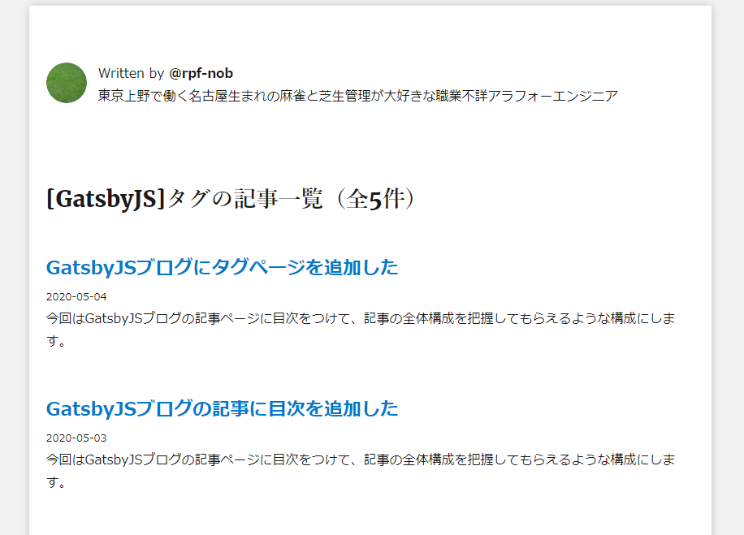
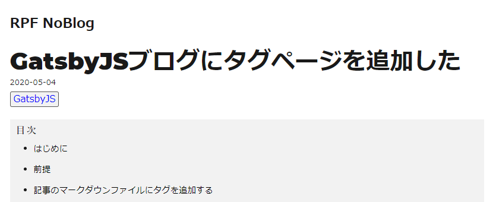

## はじめに

おはようございます！こんにちは！こんばんは！<br>
**のふのふ**([@rpf_nob](https://twitter.com/rpf_nob))と申します！！都内のスタートアップでフロントエンドエンジニアとして働いています。

今回は GatsbyJS ブログにタグページを追加して、タグごとに記事一覧が表示できるようにします。<br>
基本的には[公式ページ](https://www.gatsbyjs.org/docs/adding-tags-and-categories-to-blog-posts/)の内容通りやればできます。

<div class="iframely-embed"><div class="iframely-responsive" style="height: 140px; padding-bottom: 0;"><a href="https://www.gatsbyjs.org/docs/adding-tags-and-categories-to-blog-posts/" data-iframely-url="//cdn.iframe.ly/IVg9xer"></a></div></div>

## 前提

このブログは GatsbyJS の[gatsby-starter-blog](https://www.gatsbyjs.org/starters/gatsbyjs/gatsby-starter-blog/)のテンプレートから作成しています。

<div class="iframely-embed"><div class="iframely-responsive" style="height: 140px; padding-bottom: 0;"><a href="https://www.gatsbyjs.org/starters/gatsbyjs/gatsby-starter-blog/" data-iframely-url="//cdn.iframe.ly/qjUJkBu?iframe=card-small"></a></div></div>

<br/>

ソースコードはこちら（参考になったという方は ⭐️ をポチッと押していただけると嬉しいです〜 🙇‍♂️）

<div class="iframely-embed"><div class="iframely-responsive" style="height: 140px; padding-bottom: 0;"><a href="https://github.com/N-Iwata/noblog" data-iframely-url="//cdn.iframe.ly/Q4tAo8y?card=small"></a></div></div>

## 記事のマークダウンファイルにタグを追加する

各記事のマークダウンファイルの上部のメタ情報の部分に[tags]を追加します。複数ある場合は[,]で連結して記載します。

```html{6}
---
title: GatsbyJSブログにタグページを追加した
date: "2020-05-04"
description: 今回はGatsbyJSブログにタグページを追加して、タグごとに記事一覧が表示できるようにします。
slug: 2020-05-04/gatsby-tag
tags: [GatsbyJS]
---
```

## GraphQL のクエリを記述して投稿記事のタグを全て取得する

[GraphiQL(http://localhost:8000/\_\_\_graphql)](http://localhost:8000/___graphql)にアクセスして次のクエリを実行すれば、
下のような結果が返ってくるはずです。投稿記事を[tags]でグループ化して、各 tag の投稿数が[totalCount]として返ってきます。

```GraphQL:title=GraphiQL
{
  allMarkdownRemark {
    group(field: frontmatter___tags) {
      tag: fieldValue
      totalCount
    }
  }
}
```

```
{
  "data": {
    "allMarkdownRemark": {
      "group": [
        {
          "tag": "GatsbyJS",
          "totalCount": 5
        },
        {
          "tag": "Netlify",
          "totalCount": 1
        },
        {
          "tag": "エンジニア",
          "totalCount": 1
        },
        {
          "tag": "コロナ",
          "totalCount": 1
        },
        {
          "tag": "テレワーク",
          "totalCount": 1
        },
        {
          "tag": "肥料",
          "totalCount": 1
        },
        {
          "tag": "芝生",
          "totalCount": 1
        }
      ]
    }
  }
}
```

## タグページのテンプレートを作成する

[src/templates/tagpage/index.js]を新規作成し、タグページのテンプレートを作成していきます。<br>
基本的にはトップページと同じような見た目にしたいので、ソースコードもほとんど同じになります。<br>
コンポーネント化して共通化したいですね・・・

```js:title=src/templates/tagpage.index.jsx
import React from "react";

import Bio from "../components/bio";
import Layout from "../components/layout";
import SEO from "../components/seo";
import { rhythm } from "../utils/typography";

// Components
import { Link, graphql } from "gatsby";

const Tags = ({ pageContext, data, location }) => {
  const { tag } = pageContext;
  const { edges, totalCount } = data.allMarkdownRemark;
  const author = data.site.siteMetadata.author.name;

  const tagHeader = `[${tag}]タグの記事一覧（全${totalCount}件）`;

  return (
    <div>
      <Layout location={location} author={author}>
        <SEO title={`Tag: ${tag}`} description={`${tag}タグを含む記事の一覧ページです`} />
        <Bio />
        <h2>{tagHeader}</h2>
        {edges.map(({ node }) => {
          const title = node.frontmatter.title || node.fields.slug;
          return (
            <article key={node.fields.slug}>
              <header>
                <h3
                  style={{
                    marginBottom: rhythm(1 / 4),
                  }}
                >
                  <Link style={{ boxShadow: `none` }} to={node.frontmatter.slug}>
                    {title}
                  </Link>
                </h3>
                <small>{node.frontmatter.date}</small>
              </header>
              <section>
                <p
                  dangerouslySetInnerHTML={{
                    __html: node.frontmatter.description || node.excerpt,
                  }}
                />
              </section>
            </article>
          );
        })}
      </Layout>
    </div>
  );
};

export default Tags;

export const pageQuery = graphql`
  query($tag: String) {
    site {
      siteMetadata {
        title
        author {
          name
        }
      }
    }
    allMarkdownRemark(
      limit: 2000
      sort: { fields: [frontmatter___date], order: DESC }
      filter: { frontmatter: { tags: { in: [$tag] } } }
    ) {
      totalCount
      edges {
        node {
          fields {
            slug
          }
          frontmatter {
            title
            date(formatString: "YYYY-MM-DD")
            description
            slug
          }
        }
      }
    }
  }
`;
```

## ページをレンダリングする

[gatsby-node.js]に ↑ で作成したテンプレートを使用して、ページをレンダリングするように変更します。<br>
以下のように変更すれば、[/tags/タグ名]に各タグの記事一覧ページが作成されます。

```js{8,10,56-67}:title=gatsby-node.js
const path = require(`path`);
const _ = require("lodash");

exports.createPages = async ({ graphql, actions }) => {
  const { createPage } = actions;

  const tagTemplate = path.resolve(`./src/templates/tagpage/index.jsx`);

  const result = await graphql(
    `
      {
        posts: allMarkdownRemark(sort: { fields: [frontmatter___date], order: DESC }, limit: 1000) {
          edges {
            node {
              fields {
                slug
              }
              frontmatter {
                title
                slug
              }
            }
          }
        }
        tags: allMarkdownRemark(limit: 1000) {
          group(field: frontmatter___tags) {
            fieldValue
          }
        }
      }
    `
  );
  if (result.errors) {
    throw result.errors;
  }
  const tags = result.data.tags.group;

  tags.forEach(tag => {
    createPage({
      path: `/tags/${_.kebabCase(tag.fieldValue)}/`,
      component: tagTemplate,
      context: {
        tag: tag.fieldValue,
      },
    });
  });
};
```

これで以下のようなタグページが作成されます。


## 記事にタグページジャンプ用のタグをつける

最後に記事ページにタグページへのジャンプするためのタグをつけていきます。

### タグ表示用のコンポーネントを作成する

props で記事のタグのリストを渡してもらい、それを使ってタグページにジャンプできるようにします。

```js:title=src/components/tag/index.jsx
import React from "react";
import { Link } from "gatsby";
import _ from "lodash";

const Tag = props => {
  return (
    <div className="tag">
      {props.tags.map((tag, index) => {
        return (
          <Link to={`/tags/${_.kebabCase(tag)}/`} key={index} className="tag__list">
            {tag}
          </Link>
        );
      })}
    </div>
  );
};

export default Tag;
```

### 作成したタグコンポーネントを目次の前に挿入

[src/templates/blogpost/index.jsx]の目次の前に上で作った Tag コンポーネントを挿入します。<br>
GraphQL で取得した data.frontmatter.tags を props として渡します。

```js:title=src/templates/blogpost/index.jsx
<header>
・・・省略
</header>
<Tag tags={post.frontmatter.tags} />
<Toc data={data.markdownRemark.tableOfContents} />
<section/>
```

### スタイル調整

あとは好きなスタイルを付けて完成となります。<br>

```scss
.tag {
  margin-bottom: 20px;

  &__list {
    margin-right: 10px;
    box-shadow: none;
    border: 1px solid #555;
    padding: 0 5px;
    border-radius: 3px;
    color: blue;
    background-color: #f2f2f2;
  }
}
```



## まとめ

今回は GatsbyJS ブログにタグページを追加して、タグごとに記事一覧が表示できるようにしました。<br>
記事が増えてきたときに、タグページがあると読みたいタグを一気に見れるのでいいですよね。

他にも GatsbyJS のブログカスタマイズをいろいろやっているので、以下もあわせてご覧いただければと思います。

<div class="iframely-embed"><div class="iframely-responsive" style="height: 140px; padding-bottom: 0;"><a href="https://rpf-noblog.com/tags/gatsby-js/" data-iframely-url="//cdn.iframe.ly/5j7eIPT"></a></div></div>

<br>
<br>

最後まで見ていただきありがとうございます！！
