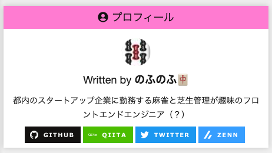

## はじめに

おはようございます！こんにちは！こんばんは！<br>
**のふのふ**([@rpf_nob](https://twitter.com/rpf_nob))と申します！！都内のスタートアップでフロントエンドエンジニアとして働いています。

今回は GatsbyJS ブログに自分の SNS へのリンクをプロフィールに追加します。

Twitter と GitHub と Qiita と Zenn へのリンクアイコンを作りたいと思います。

## 前提

このブログは GatsbyJS の[gatsby-starter-blog](https://www.gatsbyjs.org/starters/gatsbyjs/gatsby-starter-blog/)のテンプレートから作成しています。

<div class="iframely-embed"><div class="iframely-responsive" style="height: 140px; padding-bottom: 0;"><a href="https://www.gatsbyjs.org/starters/gatsbyjs/gatsby-starter-blog/" data-iframely-url="//cdn.iframe.ly/qjUJkBu?iframe=card-small"></a></div></div>

<br/>

ソースコードはこちら（参考になったという方は ⭐️ をポチッと押していただけると嬉しいです〜 🙇‍♂️）

<div class="iframely-embed"><div class="iframely-responsive" style="height: 140px; padding-bottom: 0;"><a href="https://github.com/N-Iwata/noblog" data-iframely-url="//cdn.iframe.ly/Q4tAo8y?card=small"></a></div></div>

## Bio コンポーネントを編集する

[src/components/bio/index.jsx]を編集していきます。

自己紹介文の後ろに[shields.io](https://shields.io/)のバッジを設置します。

```js:title=src/components/bio/index.jsx
const Bio = () => {
  ・・・
  return (
    <div className={styles.bio}>
      ・・・
      <div className={styles.bio__icon_wrapper}>
        <a className={styles.bio__icon} href="https://github.com/N-Iwata">
          
        </a>
        <a className={styles.bio__icon} href="https://qiita.com/rpf-nob">
          
        </a>
        <a className={styles.bio__icon} href="https://twitter.com/rpf_nob">
          
        </a>
        <a className={styles.bio__icon} href="https://zenn.dev/rpf_nob">
          
        </a>
      </div>
    </div>
  );
};
```

これで SNS リンクアイコンが設置できました！！



## まとめ

今回は GatsbyJS ブログに自分の SNS へのリンクを追加しました。
shields.io を使うとおしゃれなバッジになるのでおすすめです 👍

<br>

他にも GatsbyJS のブログカスタマイズをいろいろやっているので、以下もあわせてご覧いただければと思います。

<div class="iframely-embed"><div class="iframely-responsive" style="height: 140px; padding-bottom: 0;"><a href="https://rpf-noblog.com/tags/gatsby-js/" data-iframely-url="//cdn.iframe.ly/5j7eIPT"></a></div></div>

<br>
<br>

最後まで見ていただきありがとうございます！！
