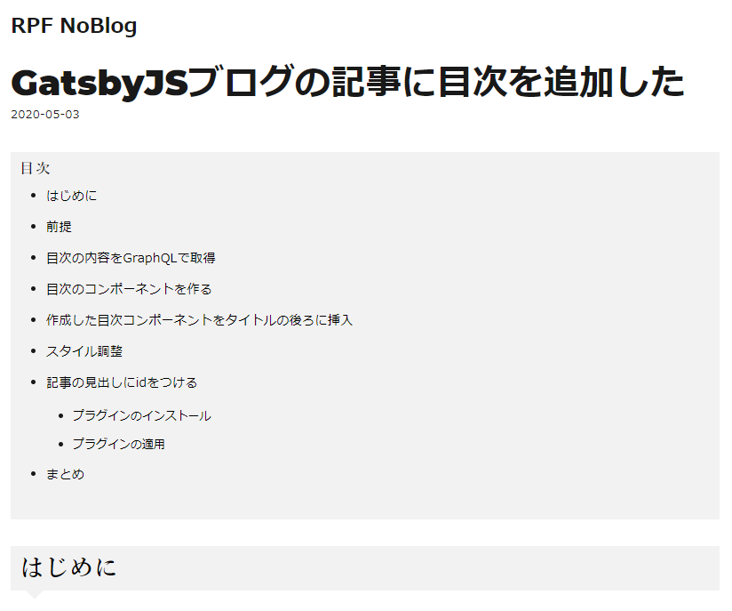

## はじめに

おはようございます！こんにちは！こんばんは！<br>
**のふのふ**([@rpf_nob](https://twitter.com/rpf_nob))と申します！！都内のスタートアップでフロントエンドエンジニアとして働いています。

今回は GatsbyJS ブログの記事ページに目次をつけて、記事の全体構成を把握してもらえるような構成にします。

## 前提

このブログは GatsbyJS の[gatsby-starter-blog](https://www.gatsbyjs.org/starters/gatsbyjs/gatsby-starter-blog/)のテンプレートから作成しています。

<div class="iframely-embed"><div class="iframely-responsive" style="height: 140px; padding-bottom: 0;"><a href="https://www.gatsbyjs.org/starters/gatsbyjs/gatsby-starter-blog/" data-iframely-url="//cdn.iframe.ly/qjUJkBu?iframe=card-small"></a></div></div>

<br/>

ソースコードはこちら（参考になったという方は ⭐️ をポチッと押していただけると嬉しいです〜 🙇‍♂️）

<div class="iframely-embed"><div class="iframely-responsive" style="height: 140px; padding-bottom: 0;"><a href="https://github.com/N-Iwata/noblog" data-iframely-url="//cdn.iframe.ly/Q4tAo8y?card=small"></a></div></div>

## 目次の内容を GraphQL で取得

[tableOfContents]というクエリで目次の内容を取得することができます。<br>
以下のように[src/templates/blogpost/index.jsx]のクエリ部分に[tableOfContents]を追記します。

```js{15}:title=src/templates/blogpost/index.jsx
export const pageQuery = graphql`
  query BlogPostBySlug($slug: String!) {
    site {
      siteMetadata {
        title
        author {
          name
        }
      }
    }
    markdownRemark(fields: { slug: { eq: $slug } }) {
      id
      excerpt(pruneLength: 160)
      html
      tableOfContents
      frontmatter {
        title
        date(formatString: "YYYY-MM-DD")
        description
        slug
      }
    }
  }
`;
```

するとこんな感じで HTML が取得できます。

```js
<ul>
  <li>
    <a href="/2020-05-03/gatsby-toc/#%E3%81%AF%E3%81%98%E3%82%81%E3%81%AB">はじめに</a>
  </li>
  <li>
    <a href="/2020-05-03/gatsby-toc/#%E5%89%8D%E6%8F%90">前提</a>
  </li>
  <li>
    <p>
      <a href="/2020-05-03/gatsby-toc/#%E7%9B%AE%E6%AC%A1%E3%81%AE%E5%86%85%E5%AE%B9%E3%82%92%E5%8F%96%E5%BE%97">
        目次の内容を取得
      </a>
    </p>
    <ul>
      <li>
        <a href="/2020-05-03/gatsby-toc/#graphql%E3%81%A7%E7%9B%AE%E6%AC%A1%E5%8F%96%E5%BE%97">
          GraphQLで目次取得
        </a>
      </li>
    </ul>
  </li>
  <li>
    <a href="/2020-05-03/gatsby-toc/#%E7%9B%AE%E6%AC%A1%E3%81%AE%E3%82%B3%E3%83%B3%E3%83%9D%E3%83%BC%E3%83%8D%E3%83%B3%E3%83%88%E3%82%92%E4%BD%9C%E3%82%8B">
      目次のコンポーネントを作る
    </a>
  </li>
  <li>
    <a href="/2020-05-03/gatsby-toc/#%E4%BD%9C%E6%88%90%E3%81%97%E3%81%9F%E7%9B%AE%E6%AC%A1%E3%82%B3%E3%83%B3%E3%83%9D%E3%83%BC%E3%83%8D%E3%83%B3%E3%83%88%E3%82%92%E3%82%BF%E3%82%A4%E3%83%88%E3%83%AB%E3%81%AE%E5%BE%8C%E3%82%8D%E3%81%AB%E6%8C%BF%E5%85%A5">
      作成した目次コンポーネントをタイトルの後ろに挿入
    </a>
  </li>
  <li>
    <a href="/2020-05-03/gatsby-toc/#%E3%82%B9%E3%82%BF%E3%82%A4%E3%83%AB%E8%AA%BF%E6%95%B4">
      スタイル調整
    </a>
  </li>
  <li>
    <a href="/2020-05-03/gatsby-toc/#%E8%A8%98%E4%BA%8B%E3%81%AE%E8%A6%8B%E5%87%BA%E3%81%97%E3%81%ABid%E3%82%92%E3%81%A4%E3%81%91%E3%82%8B">
      記事の見出しにidをつける
    </a>
  </li>
  <li>
    <a href="/2020-05-03/gatsby-toc/#%E3%81%BE%E3%81%A8%E3%82%81">まとめ</a>
  </li>
</ul>
```

## 目次のコンポーネントを作る

取得した HTML を使って目次のコンポーネントを作成します。<br>
[src/components/toc/index.jsx]を新規作成し、以下のようにソース作成します。<br>
Toc コンポーネントに取得した HTML をそのまま props で渡しています。

```js:title=src/components/toc/index.jsx
import React from "react";

const Toc = props => {
  return (
    <div className="toc">
      <h4 className="toc__title">目次</h4>
      <div
        className="toc__content"
        dangerouslySetInnerHTML={{
          __html: props.data,
        }}
      />
    </div>
  );
};

export default Toc;
```

## 作成した目次コンポーネントをタイトルの後ろに挿入

[src/templates/blogpost/index.jsx]のタイトルの後ろに上で作った Toc コンポーネントを挿入します。<br>
GraphQL で取得した data.markdownRemark.tableOfContents を props として渡します。

```js:title=src/templates/blogpost/index.jsx
<header>
・・・省略
</header>
<Toc data={data.markdownRemark.tableOfContents} />
<section/>
```

## スタイル調整

あとは好きなスタイルを付けて見た目部分は完成となります。<br>
ちなみに a タグの下線は[box-shadow]でつけてるらしいので、[text-decoration: none;]では消せません。

```scss
.toc {
  background-color: #f2f2f2;
  padding: 10px;

  &__title {
    margin: 0;
    margin-bottom: 10px;
  }
  &__content {
    & ul {
      margin-left: 30px;

      & li {
        font-size: 0.9em;
        margin: 10px 0;

        & a {
          box-shadow: none;
          color: black;
        }
      }
    }
  }
}
```

これで以下のような見た目の目次ができます。



## 記事の見出しに id をつける

次に記事の見出しに id をつけて、リンクでジャンプできるようにします。<br>
こちらは gatsby-remark-autolink-headers というプラグインを使用すれば簡単に設定できます。

<div class="iframely-embed"><div class="iframely-responsive" style="height: 140px; padding-bottom: 0;"><a href="https://www.gatsbyjs.com/plugins/gatsby-remark-autolink-headers/" data-iframely-url="//cdn.iframe.ly/6Zxe8yJ?card=small"></a></div></div>

### プラグインのインストール

プラグインをインストールします。

```
npm install --save gatsby-remark-autolink-headers
```

### プラグインの適用

インストールしたら、[gatsby-config.js]にプラグインを追加します。<br>
注意点は[gatsby-remark-prismjs]より前に読み込む必要があります。

オプションについては以下 3 つ設定しました。

- offsetY→ ジャンプした時の見出しの Y 位置。ここではナビゲーションバー分ずらすために設定しています。
- icon→ デフォのままだと、リンクアイコンが見出しに表示されるので、false に設定しています。
- id に使う文字列を大文字・小文字を保持するかどうかなので、一応 True に設定しています。

```js{7-14}:title=gatsby-config.js
module.exports = {
  plugins: [
    {
      resolve: `gatsby-transformer-remark`,
      options: {
        plugins: [
          {
            resolve: `gatsby-remark-autolink-headers`,
            options: {
              offsetY: 80,
              icon: false,
              maintainCase: true,
            },
          },
          `gatsby-remark-prismjs-title`,
          `gatsby-remark-prismjs`,
          `gatsby-remark-copy-linked-files`,
          `gatsby-remark-smartypants`,
        ],
      },
    },
  ],
};
```

すると以下のように見出しに id がふられます。<br>
ちなみに同じ名前の見出しがあっても自動的に別の id(-1 とかが後ろにつく)がふられるので問題ないです。

```HTML
<h2 id="はじめに" style="position:relative;">はじめに</h2>
```

これで、目次から見出しにジャンプできるようになりました。

## まとめ

今回は記事ページに目次をつけました。<br>
記事の内容の全体構成を把握しやすくしたほうが、読みやすいですしね。

他にも GatsbyJS のブログカスタマイズをいろいろやっているので、以下もあわせてご覧いただければと思います。

<div class="iframely-embed"><div class="iframely-responsive" style="height: 140px; padding-bottom: 0;"><a href="https://rpf-noblog.com/tags/gatsby-js/" data-iframely-url="//cdn.iframe.ly/5j7eIPT"></a></div></div>

<br>
<br>

最後まで見ていただきありがとうございます！！
