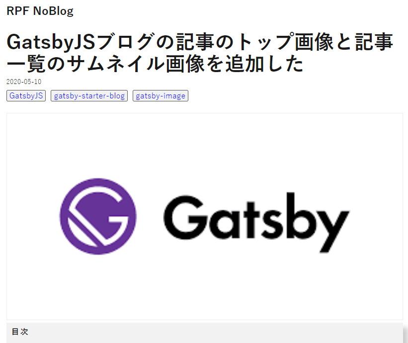
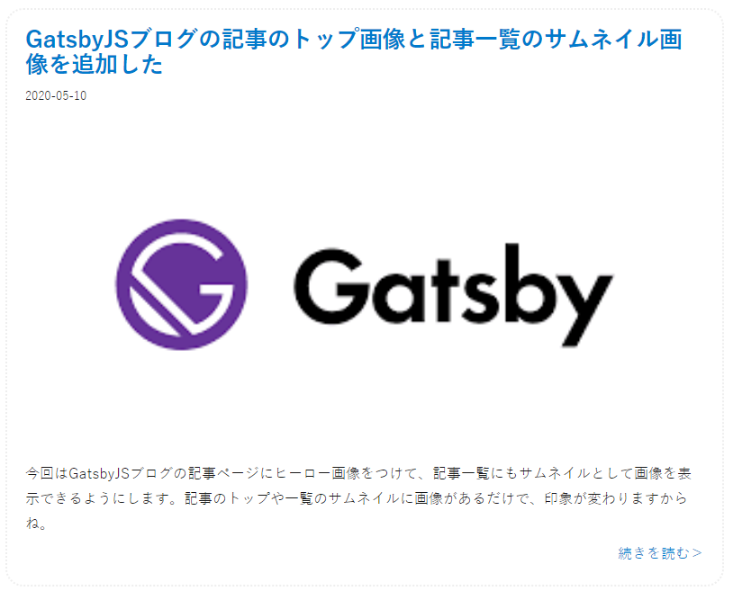

## はじめに

おはようございます！こんにちは！こんばんは！<br>
麻雀と芝生大好きおじさんこと**のふのふ**(@rpf_nob)です！！

今回は GatsbyJS ブログの記事ページにヒーロー画像をつけて、記事一覧にもサムネイルとして画像を表示できるようにします。<br>
記事のトップや一覧のサムネイルに画像があるだけで、印象が変わりますからね。

## 前提

このブログは GatsbyJS の[gatsby-starter-blog](https://www.gatsbyjs.org/starters/gatsbyjs/gatsby-starter-blog/)のテンプレートから作成しています。

<div class="iframely-embed"><div class="iframely-responsive" style="height: 140px; padding-bottom: 0;"><a href="https://www.gatsbyjs.org/starters/gatsbyjs/gatsby-starter-blog/" data-iframely-url="//cdn.iframe.ly/qjUJkBu?iframe=card-small"></a></div></div>

<br/>

ソースコードはこちら（参考になったという方は ⭐️ をポチッと押していただけると嬉しいです〜 🙇‍♂️）

<div class="iframely-embed"><div class="iframely-responsive" style="height: 140px; padding-bottom: 0;"><a href="https://github.com/N-Iwata/noblog" data-iframely-url="//cdn.iframe.ly/Q4tAo8y?card=small"></a></div></div>

## プラグインのインストール

以下コマンドで[gatsby-image]をインストールします。<br>

[公式サイト](https://www.gatsbyjs.org/docs/gatsby-image/)によると[gatsby-image]は、GraphQL と[gatsby-plugin-sharp]が提供する Gatsby のネイティブ画像処理機能とシームレスに連携して、サイトの画像読み込みを簡単かつ完全に最適化するように設計された React コンポーネントです。

[gatsby-plugin-sharp]と[gatsby-transformer-sharp]も必要なので、インストールされていなかったらインストールしてください。<br>
今回はインストールされていたので、省略しています。

```
npm install --save gatsby-image
```

## 記事のマークダウンファイルにヒーローを追加する

各記事のマークダウンファイルの上部のメタ情報の部分に[hero]を追加し、読み込みたいファイルを指定します。
マークダウンファイルと同じディレクトリに置いています。

```markdown{7}:title=markdown
---
title: GatsbyJSブログの記事のトップ画像と記事一覧のサムネイル画像を追加した
date: "2020-05-10"
description: 今回はGatsbyJSブログの記事ページにヒーロー画像をつけて、記事一覧にもサムネイルとして画像を表示できるようにします。記事のトップや一覧のサムネイルに画像があるだけで、印象が変わりますからね。
slug: 2020-05-10/gatsby-hero
tags: [GatsbyJS, gatsby-starter-blog, gatsby-image]
hero: ./hero.png
---
```

## 記事にヒーロー画像を追加する

### GraphQL のクエリ追加

[src/templates/blogposts/index.jsx]に GraphQL のクエリを以下のように追加します。<br>
hero で指定した画像を[fluid]で抽出することで、画像のサイズを最適化（srcset）できるようにしてくれます。

```js{9-15}:title=src/templates/blogposts/index.jsx
export const pageQuery = graphql`
  query BlogPostBySlug($slug: String!) {
    ・・・省略
    markdownRemark(fields: { slug: { eq: $slug } }) {
      ・・・省略
      frontmatter {
        title
        ・・・省略
        hero {
          childImageSharp {
            fluid(maxWidth: 1280) {
              ...GatsbyImageSharpFluid
            }
          }
        }
      }
    }
  }
`;
```

### BlogPostTemplate に抽出した画像を挿入

まず、[gatsby-image]をインポートします。

```js:title=src/templates/blogposts/index.jsx
import Image from "gatsby-image";
```

次に、画像を挿入したい場所に以下を追記します。<br>
今回はタグの下に挿入しています。

```js:title=src/templates/blogposts/index.jsx
<Image fluid={data.markdownRemark.frontmatter.hero.childImageSharp.fluid} />
```

すると以下のように挿入されます。



## 記事一覧にサムネイル画像を追加する

基本的にはヒーロー追加と同じです。

### GraphQL のクエリ追加

[src/pages/index.js]に GraphQL のクエリを以下のように追加します。<br>
サムネイルでも[fluid]で抽出します。

```js{11-17}:title=src/pages/index.js
export const pageQuery = graphql`
  query {
    ・・・省略
    allMarkdownRemark(sort: { fields: [frontmatter___date], order: DESC }) {
      edges {
        node {
          ・・・省略
          frontmatter {
            date(formatString: "YYYY-MM-DD")
            ・・・省略
            hero {
              childImageSharp {
                fluid(maxWidth: 1280) {
                  ...GatsbyImageSharpFluid
                }
              }
            }
          }
        }
      }
    }
  }
`;
```

### BlogIndex に抽出した画像を挿入

まず、[gatsby-image]をインポートします。

```js:title=src/pages/index.js
import Image from "gatsby-image";
```

次に、画像を挿入したい場所に以下を追記します。<br>
今回は日付の下に挿入しています。また、画像クリックでもページ遷移したいので、[Link to]を追加しています。

```js{27-32}:title=src/pages/index.js
const BlogIndex = ({ data, location }) => {
  const siteTitle = data.site.siteMetadata.title;
  const author = data.site.siteMetadata.author.name;
  const posts = data.allMarkdownRemark.edges;

  return (
    <div>
      <Layout location={location} title={siteTitle} author={author}>
        <SEO title="All posts" />
        <Bio />
        {posts.map(({ node }) => {
          const title = node.frontmatter.title || node.fields.slug;
          return (
            <div className="posts">
              <article key={node.fields.slug}>
                <header>
                  <h3 className="posts__title">
                    <Link className="posts__title__a" to={node.frontmatter.slug}>
                      {title}
                    </Link>
                  </h3>
                  <small className="posts__date">{node.frontmatter.date}</small>
                </header>
                <div className="posts__image_container">
                  <Link to={node.frontmatter.slug}>
                    <Image
                      className="posts__image"
                      fluid={node.frontmatter.hero.childImageSharp.fluid}
                    />
                  </Link>
                </div>

                <section>
                  <p
                    className="posts__desc"
                    dangerouslySetInnerHTML={{
                      __html: node.frontmatter.description || node.excerpt,
                    }}
                  />
                  <div className="posts_more">
                    <Link className="posts__more__a" to={node.frontmatter.slug}>
                      続きを読む
                    </Link>
                  </div>
                </section>
              </article>
            </div>
          );
        })}
      </Layout>
    </div>
  );
};
```

### スタイル調整

今回は以下のようにスタイル調整しています。

```scss
.posts {
  border: 2px dotted #eee;
  border-radius: 20px;
  padding: 20px;
  margin-bottom: 10px;

  &__title {
    margin: 0;
    margin-bottom: 5px;
    font-size: 1.6em;

    &__a {
      box-shadow: none;
    }
  }
  &__image_container {
    position: relative;
    overflow: hidden;
    border: 1px solid #eee;
  }
  &__image {
    margin-bottom: 5px;
    transition: all ease-in 0.5s;
    position: absolute;
    overflow: hidden;
    top: 0;
    left: 0;
    width: 100%;
    height: 100%;

    &:hover {
      transform: scale(1.1);
      overflow: hidden;
    }
  }

  &__desc {
    margin-bottom: 5px;
  }
  &__more {
    &__a {
      display: block;
      text-align: right;
      box-shadow: none;
    }
  }
}

.blog__hero {
  border: 1px solid #eee;
  margin-bottom: 5px;
}
```

すると以下のように挿入されます。



## まとめ

今回は GatsbyJS ブログの記事ページにヒーロー画像をつけて、記事一覧にもサムネイルとして画像を表示できるようにしました。

かなり印象が変わりましたね！！

他にも GatsbyJS のブログカスタマイズをいろいろやっているので、以下もあわせてご覧いただければと思います。

<div class="iframely-embed"><div class="iframely-responsive" style="height: 140px; padding-bottom: 0;"><a href="https://rpf-noblog.com/tags/gatsby-js/" data-iframely-url="//cdn.iframe.ly/5j7eIPT"></a></div></div>

<br>
<br>

最後まで見ていただきありがとうございます！！
