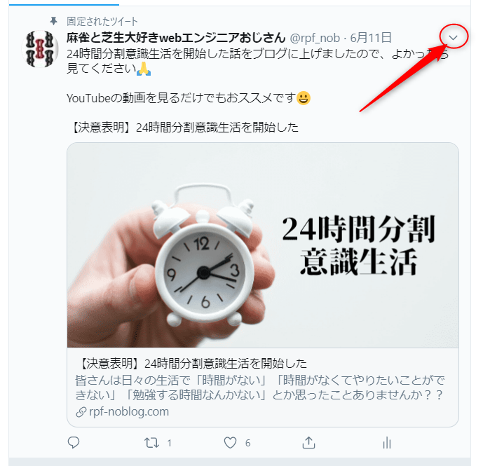
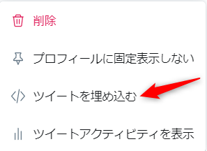
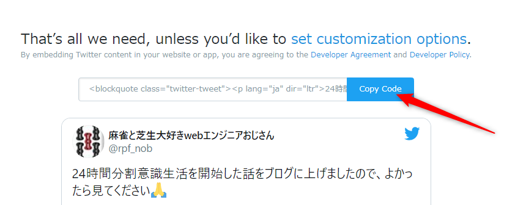

## はじめに 

おはようございます！こんにちは！こんばんは！

麻雀と芝生大好きwebエンジニアおじさん(@rpf_nob)です。

今回はGatsbyJSブログの記事にTwitterの投稿を埋め込めるようにしたので解説します。

Twitterでつぶやいたことをそのままブログの記事にしたり、他の人がつぶやいたことを参考にしたりすることもあると思うので便利ですよね！！

基本的には[公式ページ](https://www.gatsbyjs.org/packages/gatsby-plugin-twitter/)の内容通りやればできます。

<div class="iframely-embed"><div class="iframely-responsive" style="height: 140px; padding-bottom: 0;"><a href="https://www.gatsbyjs.org/packages/gatsby-plugin-twitter/" data-iframely-url="//cdn.iframe.ly/KT2GG84"></a></div></div>

* 前提
* プラグインのインストルール
* プラグインの設定
* 確認
* まとめ

## 前提

このブログはGatsbyJSの[gatsby-starter-blog](https://gatsby-starter-blog-demo.netlify.app/)のテンプレートから作成しています。

## プラグインのインストール

以下コマンドで**gatsby-plugin-twitter**をインストールします。

```
$npm install --save gatsby-plugin-twitter
```

## プラグインの設定

**gatsby-config.js**のpluginsにインストールした**gatsby-plugin-twitter**を追記します。

```js:title=gatsby-config.js
{
  plugins: [
    ・・・
    `gatsby-plugin-twitter`
    ・・・
  ]
}
```

## Twitterから埋め込み用のソースを取得

Twitterで表示するツイートを見つけ、右上隅にある**キャレット（v）**をクリックします。



そしてツイートを埋め込むを選択します。



すると、以下サイトに遷移するので、**Copy Code**を押して、ソースをコピーします。



## マークダウンに埋め込み用のソースを貼り付ける

記事のマークダウンファイルの好きな位置に先ほどコピーしたソースを貼り付けます。

注意点としては埋め込みコードをコピーするときは、blockquoteセクションのみを貼り付け、**scriptセクションは削除してください。**

```html
<blockquote class="twitter-tweet">
  <p lang="ja" dir="ltr">24時間分割意識生活を開始した話をブログに上げましたので、よかったら見てください🙏<br><br>
    YouTubeの動画を見るだけでもおススメです😀<br><br>
    【決意表明】24時間分割意識生活を開始した<br> 
    <a href="https://t.co/76MI5olUFa">https://t.co/76MI5olUFa</a>
  </p>
  &mdash;
  麻雀と芝生大好きwebエンジニアおじさん (@rpf_nob) 
  <a href="https://twitter.com/rpf_nob/status/1270856164289343488?ref_src=twsrc%5Etfw">June 10, 2020</a>
</blockquote> 
```

```html
<script async src="https://platform.twitter.com/widgets.js" charset="utf-8"></script>
```

## 確認

こんな感じで表示されれば成功です！！

簡単ですね！！

<blockquote class="twitter-tweet"><p lang="ja" dir="ltr">24時間分割意識生活を開始した話をブログに上げましたので、よかったら見てください🙏<br><br>YouTubeの動画を見るだけでもおススメです😀<br><br>【決意表明】24時間分割意識生活を開始した<br> <a href="https://t.co/76MI5olUFa">https://t.co/76MI5olUFa</a></p>&mdash; 麻雀と芝生大好きwebエンジニアおじさん (@rpf_nob) <a href="https://twitter.com/rpf_nob/status/1270856164289343488?ref_src=twsrc%5Etfw">June 10, 2020</a></blockquote> 

## まとめ

今回はGatsbyJSブログの記事にTwitterの投稿を埋め込めるようしました！！
 
Twitterでつぶやいたことをそのままブログの記事にしたり、他の人がつぶやいたことを参考にしたりすることもあると思うので便利ですよね！！


最後まで見ていただきありがとうございます！！