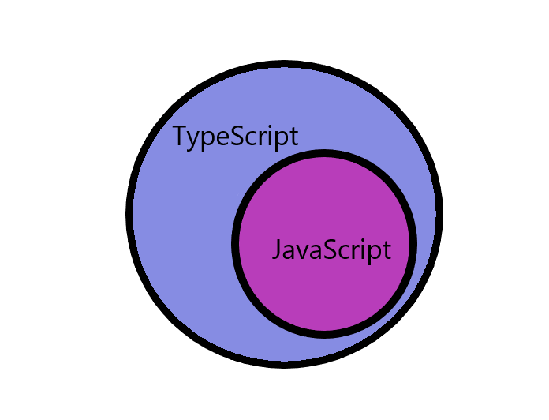
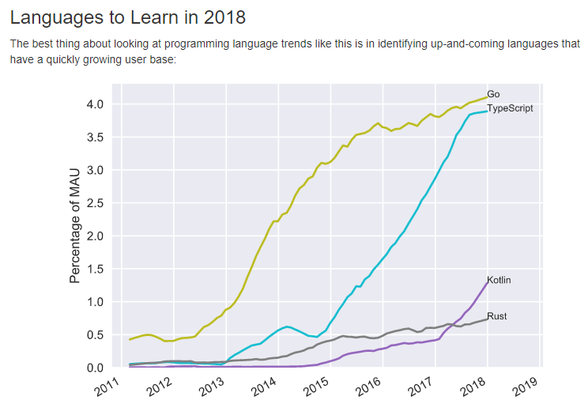

## はじめに

おはようございます！こんにちは！こんばんは！<br>
**のふのふ**([@rpf_nob](https://twitter.com/rpf_nob))と申します！！都内のスタートアップでフロントエンドエンジニアとして働いています。

エンジニア（特にフロントエンドエンジニア）の皆さん、TypeScript を使っていますか？？<br>使っていない人はこんな疑問持ってませんか？？

- JavaScript と何が違うの？
- 何がそんなにいいの？
- 簡単？

というわけで今回から、【TypeScript 超入門】としまして、上記のような疑問を持っていた**私自身**が TypeScript について学んだこと・調べたことをまとめて解説していきたいと思います。

自分の備忘録的に書いていきますが、誰かの役に立てば幸いです。

今回は以下 5 つで書いていきます！！

- TypeScript とは？
- TypeScript のメリット・デメリットは？
- なぜ今 TypeScript 学習するのか？
- 環境構築方法
- もっと環境構築

ソースコードは以下 GitHub を参照してください。

<div class="iframely-embed"><div class="iframely-responsive" style="height: 140px; padding-bottom: 0;"><a href="https://github.com/N-Iwata/start-typescript" data-iframely-url="//cdn.iframe.ly/mWiO3U9"></a></div></div>

## TypeScript とは？


TypeScript は Microsoft 社によって開発され、2012 年 10 月頃に外部公開された、JavaScript を拡張して作られたプログラミング言語です。

[公式サイト](https://www.typescriptlang.org)には以下のように書かれています。

<div class="iframely-embed"><div class="iframely-responsive" style="height: 140px; padding-bottom: 0;"><a href="https://www.typescriptlang.org" data-iframely-url="//cdn.iframe.ly/Dlsd1vH"></a></div></div>

<br>

> TypeScript is a typed superset of JavaScript that compiles to plain JavaScript.

日本語に訳すと以下のようになります。

> Typescript はプレーンな Javascript にコンパイルされる Javascrip の型付きのスーパーセット（上位集合）です。

つまり下の画像のような関係性ということになります。<br>
型(Type)の概念を JavaScript に取り入れて拡張したのが、TypeScript というイメージですね。

また、TypeScript は JavaScript にコンパイルされるので、JavaScript が動く環境（ブラウザや Node.js）であれば問題なく使えます。



## TypeScript のメリット・デメリットは？


メリット・デメリットについて解説していきます。

### メリット

#### 個人開発時

まず、個人開発時におけるメリットですが、何といっても**型の概念**でしょう。

[公式サイト](https://www.typescriptlang.org/index.html)にも以下のように書かれています。

> Types enable JavaScript developers to use highly-productive development tools and practices like static checking and code refactoring when developing JavaScript applications.

日本語に訳すと以下のようになります。

> 型により、JavaScript 開発者は、JavaScript アプリケーションの開発時に、静的チェックやコードリファクタリングなどの生産性の高い開発ツールや手法を使用できます。

簡単に言うと、コードを実行しなくても、コードを書いている最中に型をチェックしてくれてエラーを出してくれるツールを使用できるということですね。

JavaScript は動的型付け言語なので、数値が入っている変数に文字列を代入してもエラーにならないですし、静的チェックもできません。

こういったエラーを事前にチェックできるということが最大のメリットということですね。

#### チーム開発時

また、多人数でのチーム開発時において、他者の作成したコードを修正したり、レビューしたりする時ありますよね。

型があることによって、この変数がどういった値が入っているのかとか、この関数の戻り値はどういった値なのかが一目でわかるようになるので、ソースの可読性がかなり上がります。

言うなれば、**ソース自体がドキュメント**になるということですね。

結果、ソースの可読性が上がることによって、開発の生産性やソースの保守性が上がります。

#### まとめると

- 事前にエラーをチェックでき、生産性と保守性が上がる！
- 多人数チーム開発において、ソースの可読性が上がることによって、生産性と保守性が上がる！

いいことずくめですね！！

### デメリット

あまりデメリットが思い浮かばなかったのですが、いろいろサイトを調べてみたところ以下の内容が多くがあげられていました。

- 学習コストがかかる
- 日本語の情報が少ない
- JavaScript より複雑さが増す
- ・・・

学習コストについては、個人的にはそれほど高くないように思えます。
基本的には、JavaScript を先に勉強していれば、型の概念の追加分だけですしね。

日本語の情報が少ないことについては、他の言語やライブラリでも同じことが言えるので、しょうがないですよね。エンジニアなら英語のドキュメントを読めるスキルはあったほうがいいですね。

## なぜ今 TypeScript 学習するのか？


### Google が社内標準言語へ

2017 年 4 月に開催された「Angular」のイベント「ng-conf 2017」で TypeScript が Google 社内の標準言語（フロントエンドにおける）に初めて採用されたことを発表しています。

このことからもかなり将来性がある言語ということがわかりますね。

[→ 参考にしたサイト](https://www.publickey1.jp/blog/17/googletypescriptng-conf_2017.html)

<div class="iframely-embed"><div class="iframely-responsive" style="height: 140px; padding-bottom: 0;"><a href="https://www.publickey1.jp/blog/17/googletypescriptng-conf_2017.html" data-iframely-url="//cdn.iframe.ly/iDzidf8?iframe=card-small"></a></div></div>

### 世界的にアクティブユーザーの伸びがやばい

下の図は[GitHub の Monthly Active Users のグラフ](http://www.benfrederickson.com/ranking-programming-languages-by-github-users/)ですが、Typescript は Go に続いて 2 位となっていて、急激に成長し、伸びていることがわかりますね。

世界で伸びている言語は数年後に日本でも主流になることが予想されるので、学習すべき理由になりますよね。



### フロントエンド開発においては JavaScript 一択

web アプリケーション開発において、**フロントエンド開発は JavaScript 一択**の状況であり、TypeScript は Javascript の弱いところを補い、JavaScript と互換性がある。

また、フロントエンドの 3 大フレームワーク（React はライブラリですが）の AngularJS・React・Vue.js でも使用できます。

このことからも**今後 TypeScript の需要が伸びていく**ことが予想されています。

### まとめると

- 将来性がある
- アクティブユーザーの伸びがすごい
- フロントエンドでは JavaScript 一択

上記のことから、今勉強しなければならない理由がわかりますね！

## 環境構築方法


ここからは環境構築から Hello World までを解説していきます。

### Node.js インストール

[公式サイト](https://nodejs.org/ja/download/)から LTS 版をインストールしてください。

インストールが完了し、以下コマンドをターミナルで実行してバージョンが表示されれば、問題ありません。

```
$ node -v
v12.15.0

$ npm -v
6.13.4
```

### package.json を生成する

まずは package.json を作成します。適当なディレクトリに移動して、以下コマンドで作成します。ここでは-y をつけて全てデフォルトでいきます。

```
$ npm init -y
```

### TypeScript インストール

次に npm を使用し Typescript をインストールしていきます。<br>
ここでは **--save-dev** をつけて、ローカル環境にインストールします。

```
$ npm install typescript --save-dev
```

インストールが完了し、以下コマンドをターミナルで実行してバージョンが表示されれば、問題ありません。

ローカル環境にインストールした場合は**npx**をつけてやらないとコマンドが使えないので注意してください。node_modules ディレクトリ配下にあるコマンドを自動で検索してくれるものらしいです。

```
$ npx tsc -v
Version 3.9.5
```

### tsconfig.json を生成する

以下コマンドを実行すれば、**tsconfig.json**を生成できます。

とりあえず生成したもののままで大丈夫でしょう。この辺りはプロジェクトによって変更してください。

```
$ npx tsc --init
```

### 動作確認する

動作確認のためにとりあえず src ディレクトリと TypeScript ファイルを作成します。

```
$ mkdir src
$ touch src/01_hello-world/010_hello-world.ts
```

ファイルができたら**Hello World!**を出力するプログラムを以下のように書きます。

```ts:title=src/01_hello-world/010_hello-world.ts
const message: string = "Hello World!";
console.log(message);
```

ファイルを保存したら以下コマンドで、TypeScript ファイルを JavaScript ファイルにコンパイルできます。

```
$ npx tsc src/01_hello-world/010_hello-world.ts
```

**src/01_hello-world**ディレクトリに**010_hello-world.js**ができあがるので、以下コマンドで実行してみましょう。**Hello World!**と表示されれば OK です！！

```
$ node src/01_hello-world/010_hello-world.js
Hello World!
```

## もっと環境構築

動作確認はできましたが、コードに変更があるたびに**tsc**コマンドでコンパイルして、**node**コマンドで実行するのはめんどくさいですよね。

ここではもっといい環境構築を解説していきます！

### ts-node をインストール

以下コマンドで、**ts-node**をインストールします。

```
$ npm install ts-node --save-dev
```

**ts-node**は TypeScript から JavaScript にコンパイルしたものをそのまま実行できます。<br>

次のコマンドで試してみましょう。**Hellow World!**と出力されれば OK です！
ちなみに**010_hello-world.js**は作成されません。

```
$ npx ts-node src/01_hello-world/010_hello-world.ts
Hello World!
```

### ts-node-dev をインストール

**ts-node**で少し楽になりましたが、まだコード修正のたびにコマンドを実行しなければなりません。そこで登場するのが**ts-node-dev**パッケージです！

以下コマンドで、**ts-node-dev**をインストールします。

```
$ npm install ts-node-dev --save-dev
```

パッケージのインストールが完了したら以下コマンドを実行します。<br>
すると[Hello World!]がまずは出力されます。

```
$ npx ts-node-dev --respawn src/01_hello-world/010_hello-world.ts
Hello World!
```

では次に**010_hello-world.ts**を少し修正して保存してみましょう。

```typescript{1}:title=src/01_hello-world/010_hello-world.ts
const message: string = "Hello Japan!";
console.log(message);
```

保存した瞬間にコードの修正を反映して、実行されたことがわかりますね！！

```
Hello Japan!
```

これでコンパイル → 実行までがだいぶ楽になりました！！<br>
基本的には**ts-node-dev**を使うと開発しやすいと思います。

### npm-scripts に実行コマンドを追加

最後に**ts-node-dev**を簡単に呼び出せるように**package.json**の**scripts**に実行コマンドを追加します。

```js{3}:title=package.json
"scripts": {
  "test": "echo \"Error: no test specified\" && exit 1",
  "dev": "ts-node-dev --respawn"
}
```

これで以下コマンドで動作確認します。

```
$ npm run dev src/01_hello-world/010_hello-world.ts
```

上と同じように出力されれば問題ありません。

これで TypeScript の環境構築が完了です！！

### まとめ

今回は TypeScript を以下のように解説しました！！

- TypeScript とは？
- TypeScript のメリット・デメリットは？
- なぜ今 TypeScript 学習するのか？
- 環境構築方法
- もっと環境構築

TypeScript をいつ学ぶの？？今でしょ！！！（古いっ！）<br>
冗談はおいといて、今学ぶべき言語であることがお判りいただけたでしょうか？

環境構築もそれほど大変ではないので、勉強もしやすいですね！

今後は、TypeScript の基本的な型の部分から高度な型まで解説するのと、React に適用した場合など解説していけたらと思っています。

私自身も勉強中ですが、勉強しながらしっかりまとめていきますので、続きを見ていただければ幸いです。間違いとかありましたら、Twitter の DM か CONTACT ページからお問い合わせしていただければと思います。

最後まで見ていただきありがとうございました！！

TypeScript 超入門シリーズの他の記事もご覧いただければうれしいので是非お願いします！！

<div class="iframely-embed"><div class="iframely-responsive" style="height: 140px; padding-bottom: 0;"><a href="https://rpf-noblog.com/2020-06-17/start-typescript-01/" data-iframely-url="//cdn.iframe.ly/tmxszMy?iframe=card-small"></a></div></div>

<div class="iframely-embed"><div class="iframely-responsive" style="height: 140px; padding-bottom: 0;"><a href="https://rpf-noblog.com/2020-06-22/start-typescript-02/" data-iframely-url="//cdn.iframe.ly/GsezT0D?iframe=card-small"></a></div></div>

<div class="iframely-embed"><div class="iframely-responsive" style="height: 140px; padding-bottom: 0;"><a href="https://rpf-noblog.com/2020-06-25/start-typescript-03/" data-iframely-url="//cdn.iframe.ly/dOMYRKX?iframe=card-small"></a></div></div><script async src="//cdn.iframe.ly/embed.js" charset="utf-8"></script>

<div class="iframely-embed"><div class="iframely-responsive" style="height: 140px; padding-bottom: 0;"><a href="https://rpf-noblog.com/2020-06-28/start-typescript-04/" data-iframely-url="//cdn.iframe.ly/lpldZS4?iframe=card-small"></a></div></div><script async src="//cdn.iframe.ly/embed.js" charset="utf-8"></script>

<div class="iframely-embed"><div class="iframely-responsive" style="height: 140px; padding-bottom: 0;"><a href="https://rpf-noblog.com/2020-07-05/start-typescript-05/" data-iframely-url="//cdn.iframe.ly/LXlpIFZ?iframe=card-small"></a></div></div>

<div class="iframely-embed"><div class="iframely-responsive" style="height: 140px; padding-bottom: 0;"><a href="https://rpf-noblog.com/2020-07-15/start-typescript-06/" data-iframely-url="//cdn.iframe.ly/pnXu3dX?iframe=card-small"></a></div></div>

<div class="iframely-embed"><div class="iframely-responsive" style="height: 140px; padding-bottom: 0;"><a href="https://rpf-noblog.com/2020-07-18/start-typescript-07/" data-iframely-url="//cdn.iframe.ly/zWpJ6LT?iframe=card-small"></a></div></div>

<div class="iframely-embed"><div class="iframely-responsive" style="height: 140px; padding-bottom: 0;"><a href="https://rpf-noblog.com/2020-07-26/start-typescript-08/" data-iframely-url="//cdn.iframe.ly/hyokrE0?iframe=card-small"></a></div></div>
