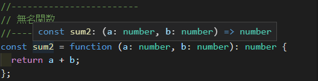

## はじめに 

おはようございます！こんにちは！こんばんは！<br>
麻雀と芝生大好きおじさんこと**のふのふ**(@rpf_nob)です！！

この記事はTypeScript超入門シリーズの第3回目として、TypeScriptの関数についてまとめて解説していきます！

[TypeScript 超入門#01 概要説明~環境構築編](https://rpf-noblog.com/2020-06-17/start-typescript-01)<br>
[TypeScript 超入門#02 基本的な型編](https://rpf-noblog.com/2020-06-22/start-typescript-02)<br>
[TypeScript 超入門#03 関数編](https://rpf-noblog.com/2020-06-25/start-typescript-03)<br>
[TypeScript 超入門#04 クラス編](https://rpf-noblog.com/2020-06-28/start-typescript-04)<br>
[TypeScript 超入門#05 ジェネリクス編](https://rpf-noblog.com/2020-07-05/start-typescript-05)<br>
[TypeScript 超入門#06 型推論基礎編](https://rpf-noblog.com/2020-07-15/start-typescript-06)<br>
[TypeScript 超入門#07 型の互換性編](https://rpf-noblog.com/2020-07-18/start-typescript-07)<br>
[TypeScript 超入門#08 型安全編](https://rpf-noblog.com/2020-07-26/start-typescript-08)<br>

* 関数の基本的な書き方
* パラメータ関連
* オーバーロード

GitHubのリポジトリは[こちら](https://github.com/N-Iwata/start-typescript)にあります。

## 関数の基本的な書き方

基本的にはJavaScriptの関数に引数と戻り値に型を指定してあげるだけです。

### function

```ts:title=src/03_function-types.ts
function sum1(a: number, b: number): number {
  return a + b;
}
console.log(sum1(1, 2));  //→3
```

### 無名関数

```ts:title=src/03_function-types.ts
const sum2 = function (a: number, b: number): number {
  return a + b;
};
console.log(sum2(3, 4));  //→7
```

無名関数を変数に入れておく場合の変数のほうにも型を設定しておきたい場合は以下のように書きます。

```ts:title=src/03_function-types.ts
const sum2: (a: number, b: number) => number = function (
  a: number,
  b: number
): number {
  return a + b;
};
```

VSCodeだとsum2のところにカーソルを合わすと↓の画像のように推論されるので、これの型の部分を変数につけてあげれば終わりです。



### アロー関数

```ts:title=src/03_function-types.ts
const sum3 = (a: number, b: number): number => {
  return a + b;
};
console.log(sum3(5, 6));  //→11
```

アロー関数も無名関数と同じように、変数のほうにも型を設定しておくことができます。

### 値を返さない関数

前回の**void型**の時に少し解説しましたが、値を返さない関数には**void型**を指定します。

```ts:title=src/02_basic-types.ts
function logger(message: string): void {
  console.log(message); //→Hello World!
}
logger("Hello World!");
```

また、前回の**never型**の時に少し解説しましたが、エラーを投げるだけの関数など、戻り値を得られない関数には**never型**を指定します。

```ts:title=src/02_basic-types.ts
function error(message: string): never {
  throw new Error(message);
}
error("Error!");
```

## パラメータ関連

### オプショナルパラメータ

引数の後ろに[?]を付けることで、引数を指定しなくても関数が動作するようになります。

指定していない引数は[undefined]になります。

次の場合は[isLog]が[undefined]になるため、if文ではじかれてコンソールに表示されません。

```ts:title=src/03_function-types.ts
const sum4 = (a: number, b: number, isLog?: boolean): number => {
  if (isLog) {
    console.log(a + b);
  }
  return a + b;
};
sum4(7, 8, true);   //→15
sum4(7, 8, false);  //→何も表示されない
sum4(7, 8);       　//→何も表示されない
```

### デフォルトパラメータ

基本的にはJavaScriptと同じ書き方です。

引数を指定しない場合のデフォルトの値を関数宣言時に記載すれば、引数を指定しない場合のその値を使用して結果を返します。

次の場合は引数を指定してあげれば、その値で計算を実行し、指定しなければ、デフォルトの[1.1]で計算を実行しています。

```ts:title=src/03_function-types.ts
const sum5 = (a: number, b: number, rate: number = 1.1): number => {
  return (a + b) * rate;
};
console.log(sum5(500, 500, 1.05));  //→1050
console.log(sum5(500, 500));  //→1100
```

### Restパラメータ

[Rest]パラメータを引数にする場合は、配列で型付けしてあげます。

次の場合は引数を1~10までRestパラメータで受け取って、合計値を[reduce]を使用して求めています。

```ts:title=src/03_function-types.ts
const sum6 = (...values: number[]): number => {
  console.log(values);  //→[1, 2, 3, 4, 5, 6, 7, 8, 9, 10]
  const ret: number = values.reduce((acc: number, cur: number): number => {
    return acc + cur;
  });
  return ret;
};

console.log(sum6(1, 2, 3, 4, 5, 6, 7, 8, 9, 10));　//→55
```

## オーバーロード

c++やJavaなど他の静的型付け言語にもある関数のオーバーロードの機能はTypeScriptにもあります。

先に関数の型だけを宣言してあげて、実態のところは[any型]を指定してあげます。

次の場合は[number型]の場合は2倍にして返し、[string型]の場合は文字をつなげる処理の例です。

[any型]で引数を受けて、[typeof]を使用して処理の分岐を行います。

[any型]で引数を受けていますが、先に関数の型を定義しているため、指定していない型（ここではboolean型）を引数に指定するとコンパイルエラーになります。

```ts:title=src/03_function-types.ts
function sum7(a: number): number;
function sum7(a: string): string;
function sum7(a: any): any {
  if (typeof a === "number") {
    return a * 2;
  } else {
    return `${a} ${a}`;
  }
}

console.log(sum7(100)); //→200
console.log(sum7("Hey")); //→Hey Hey
console.log(sum7(false)); //→NG
```


## まとめ

今回はTypeScriptの関数について解説を行いました。<br>

関数についてもJavaScriptとそんなに変わらないので、すぐ覚えられそうですね。

次回はクラスについてまとめていきたいと思います。

最後まで見ていただきありがとうございました！！

TypeScript超入門シリーズの他の記事もご覧いただければうれしいので是非お願いします！！

<div class="iframely-embed"><div class="iframely-responsive" style="height: 140px; padding-bottom: 0;"><a href="https://rpf-noblog.com/2020-06-17/start-typescript-01/" data-iframely-url="//cdn.iframe.ly/tmxszMy?iframe=card-small"></a></div></div>

<div class="iframely-embed"><div class="iframely-responsive" style="height: 140px; padding-bottom: 0;"><a href="https://rpf-noblog.com/2020-06-22/start-typescript-02/" data-iframely-url="//cdn.iframe.ly/GsezT0D?iframe=card-small"></a></div></div>

<div class="iframely-embed"><div class="iframely-responsive" style="height: 140px; padding-bottom: 0;"><a href="https://rpf-noblog.com/2020-06-25/start-typescript-03/" data-iframely-url="//cdn.iframe.ly/dOMYRKX?iframe=card-small"></a></div></div>

<div class="iframely-embed"><div class="iframely-responsive" style="height: 140px; padding-bottom: 0;"><a href="https://rpf-noblog.com/2020-06-28/start-typescript-04/" data-iframely-url="//cdn.iframe.ly/lpldZS4?iframe=card-small"></a></div></div>

<div class="iframely-embed"><div class="iframely-responsive" style="height: 140px; padding-bottom: 0;"><a href="https://rpf-noblog.com/2020-07-05/start-typescript-05/" data-iframely-url="//cdn.iframe.ly/LXlpIFZ?iframe=card-small"></a></div></div>

<div class="iframely-embed"><div class="iframely-responsive" style="height: 140px; padding-bottom: 0;"><a href="https://rpf-noblog.com/2020-07-15/start-typescript-06/" data-iframely-url="//cdn.iframe.ly/pnXu3dX?iframe=card-small"></a></div></div>

<div class="iframely-embed"><div class="iframely-responsive" style="height: 140px; padding-bottom: 0;"><a href="https://rpf-noblog.com/2020-07-18/start-typescript-07/" data-iframely-url="//cdn.iframe.ly/zWpJ6LT?iframe=card-small"></a></div></div>

<div class="iframely-embed"><div class="iframely-responsive" style="height: 140px; padding-bottom: 0;"><a href="https://rpf-noblog.com/2020-07-26/start-typescript-08/" data-iframely-url="//cdn.iframe.ly/hyokrE0?iframe=card-small"></a></div></div>