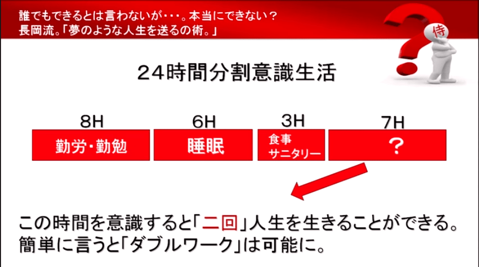

## はじめに

おはようございます！こんにちは！こんばんは！ 
**のふのふ**([@rpf_nob](https://twitter.com/rpf_nob))と申します！！都内のスタートアップでフロントエンドエンジニアとして働いています。

皆さんは日々の生活で「時間がない」「時間がなくてやりたいことができない」「勉強する時間なんかない」とか思ったことありませんか？？

私も常々そう思ってしまっていました。しかし YouTube である動画を見た時に、今までの人生を全て否定するような衝撃を受けたことにより、【24 時間分割意識生活】を実行することを決意しました。

今回は以下 3 つで書いていきます！！

- 24 時間分割意識生活とは？
- なぜ 24 時間分割意識生活をやろうと思ったのか？
- 最終的な目標は？

## 24 時間分割意識生活とは？

2014 年 5 月に開催された TEDxSaku で長岡秀貴さんによる「時間という財産」という発表の中で 24 時間分割意識生活の話をされています。

`youtube:https://www.youtube.com/embed/EzXvih454dM`

【24 時間分割意識生活】を簡単にざっくり言うと 1 日 24 時間を細かく分割して生活するという考え方のことです。

- 勤労・勤勉（ライスワーク）→8 時間
- 睡眠 →6 時間
- 食事・サニタリー →3 時間

　　　　　　引用：[YouTube](https://youtu.be/EzXvih454dM)

普通に 8 時間食べていくためにライスワークをして、6 時間ちゃんと寝て、家族と食事やお風呂などを普通にしていても、7 時間は余るので、この 7 時間を見つけた人間が人生を 2 回送る（ダブルワーク）ことができる。

- 1 つの人生は食べていくための**ライスワーク**に使う。
- 1 つの人生は夢を叶えていったり、人のために時間を使っていくような**ライクワーク**に使う。

この考え方を知った時に、「時間がない」は言い訳に過ぎないという真実に気づかされました。

## なぜ 24 時間分割意識生活をやろうと思ったのか？

### 自身の生活で無駄な時間を考えてみる

私自身、日々の生活の中で相当な無駄な時間を過ごしてしました。

- スマホゲームをだらだらとやる
- テレビ・YouTube・SNS をだらだらと見る
- 会社での付き合いの飲み会
- ・・・

皆さんも思い当たりませんか？？ 
この無駄な時間をなくせば、全然時間ってありますよね。

### ライクワークで人生を変えたい

今までは普通に会社に勤めていて、家族がいて、家も購入し、どこか保守的に人生を送ってきたので、積極的に自分のやりたいことをやったり、人のために時間を使っていくことがしたいと考えました。
 
 
このライクワークをすることによって、本当に人生を変えられると思っています。

また、勤めている業界もいつなくってもおかしくないですし、いつ会社をクビになるかもわかりません。 
こういうリスクもあるので、このライクワークがライスワークに変わっていってもいいですしね。

## 最終的な目標は？

### 誰かの人生を変えるようなことがしたい

今までの仕事では誰かの人生を劇的に変えたということは体験できませんでした。 
自分の人生も変えられないようでは、他人の人生なんか変えられないですよね。

マコなり社長が YouTube で「自分の心のコップからあふれた水でしか、他人の心のコップを満たすことはできない」と言っているように、まずは自分の人生を変えて行くところから始めないといけないですよね。

### じゃあ実際何をするのか？

今まで常々やりたいと思っていたけど時間がないと思っていてやっていなかったことを最終目標にしたいです。

**個人開発でサービスをリリースする！！**

これをやることによって、自身がやりたかったことも満たせますし、誰かの人生も変えられるかもしれない。こういうライクワークをすることで幸せな人生が送れるのではと思います。

そのために、まずは web 開発スキル向上のための勉強と、どういったサービスをリリースすれば誰かの人生を変えられるかを日々考えていきます！！

## まとめ

今回は【24 時間分割意識生活】を開始する決意表明をしました！！

- 時間がなくてやりたいことができない
- 人生を変えたい

なんて思っている人はこの【24 時間分割意識生活】を実践するのをおすすめします！

私自身も始めたばかりなので、どういう風に人生が変わっていくのか楽しみです！ 
三日坊主で終わらないように毎日 twitter でも発信していきますし、このブログでも定期的に結果等を発信していく予定です！！

最後まで見ていただきありがとうございました！！！！！
