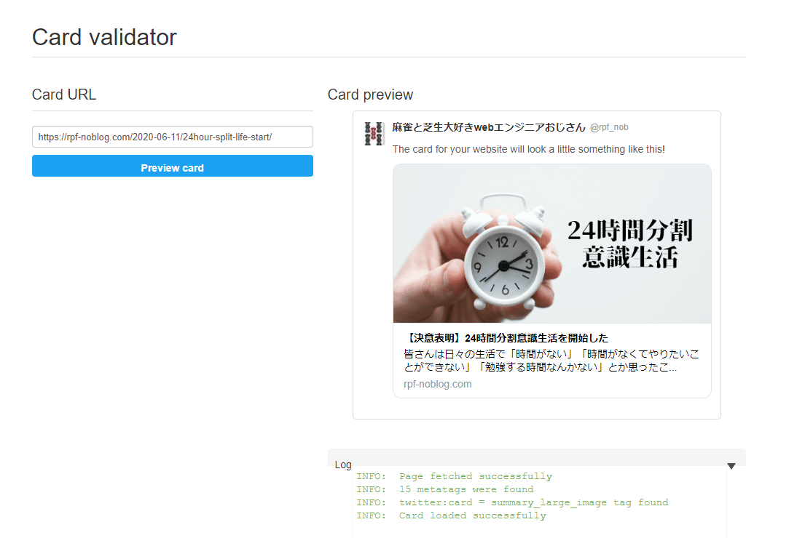

## はじめに 

おはようございます！こんにちは！こんばんは！

麻雀と芝生大好きwebエンジニアおじさん(@rpf_nob)です。

今回はGatsbyJSブログのOGP画像を記事ごとに生成できるようにしたので解説していきます。

twitterなどにリンクを張る時に記事のトップ画像を表示するだけで、まともな記事に見えるので絶対にやったほうがいいですよね！

* 前提
* プラグインのインストルール
* プラグインの設定
* デフォルト画像の準備
* 記事ごとの画像の準備
* SEOコンポーネントの修正
* 確認
* まとめ

## 前提

このブログはGatsbyJSの[gatsby-starter-blog](https://www.gatsbyjs.org/starters/gatsbyjs/gatsby-starter-blog/)のテンプレートから作成しています。

<div class="iframely-embed"><div class="iframely-responsive" style="height: 140px; padding-bottom: 0;"><a href="https://www.gatsbyjs.org/starters/gatsbyjs/gatsby-starter-blog/" data-iframely-url="//cdn.iframe.ly/qjUJkBu?iframe=card-small"></a></div></div>

## プラグインのインストール

以下コマンドで[gatsby-plugin-react-helmet]と[react-helmet]をインストールします。

[gatsby-starter-blog]を使用している場合は、インストールされているので、省略してください。

```
$npm install --save gatsby-plugin-react-helmet react-helmet
```

## プラグインの設定

[gatsby-config.js]のpluginsにインストールした[gatsby-plugin-react-helmet]を追記します。

[gatsby-starter-blog]を使用している場合は、設定されているので、省略してください。

```js:title=gatsby-config.js
{
  plugins: [
    ・・・
    `gatsby-plugin-react-helmet`
    ・・・
  ]
}
```

## デフォルト画像の準備

[gatsby-starter-blog]を使用している場合は、基本的にタイトルや概要などは既に設定されているので、修正するのは画像の部分だけで大丈夫かと思います。


記事自体にリンクを張る場合はトップ画像を設定するのですが、それ以外のページのリンクを張る場合は固定の画像を表示するために、[src/images]ディレクトリに[default_image.png]を用意します。

用意した画像をインポートしておきます。

```js:title=src/components/seo.js
import ogp_image from "../images/default_image.png";
```

次に以下のようにすれば、デフォルト画像のURLが取得できます。

```js:title=src/components/seo.js
const siteUrl = site.siteMetadata.siteUrl;
const defaultImage = `${siteUrl}${ogp_image}`;
```

```
https://rpf-noblog.com/static/default_image.png
```

## 記事ごとの画像の準備

記事ごとの画像は、前に紹介した[GatsbyJSブログの記事のトップ画像と記事一覧のサムネイル画像を追加した](https://rpf-noblog.com/2020-05-10/gatsby-hero)で使用している画像をそのまま使います。

[GraphQL](http://localhost:8000/___graphq)で画像のありかを探すと、
```
allMarkdownRemark / edges / node / frontmatter / hero / childImageSharp / fluid / src
```

のところにあることがわかるので、[src/templates/blog-post.js]を追記していきます。

```js:title=src/templates/blog-post.js
const hero = post.frontmatter.hero.childImageSharp.fluid.src;
const image = `${siteUrl}${hero}`;  // これが記事ごとのトップ画像のURLになる
```

[SEO]コンポーネントにその画像URLを渡します。

```js{4}:title=src/templates/blog-post.js
<SEO
  title={post.frontmatter.title}
  description={post.frontmatter.description || post.excerpt}
  image={image}
/>
```

## SEOコンポーネントの修正

最後にSEOコンポーネントの[Helmet]タグの中を書き換えて終了です。

[image]に記事ごとの画像のURL、[defaultImage]にデフォルトの画像のURLが入っているので、

`content: image || defaultImage`

のようにして、propsで渡されれば記事ごとの画像で表示するようにします。

```js{4-5}:title=src/components/seo.js
<Helmet
  meta={[
    {
      property: "og:image",
      content: image || defaultImage,
    },
  ].concat(meta)}
/>
```

あと、[twitter:card]のところを[summary_large_image]にしておけば、

```js{4-5}:title=src/components/seo.js
<Helmet
  meta={[
    {
      name: `twitter:card`,
      content: `summary_large_image`,
    },
  ].concat(meta)}
/>
```

↓の画像のように大きいサイズの画像リンクを使うことができます。


## 確認

[Card validator](https://cards-dev.twitter.com/validator)というサイトでOGPのイメージを確認することができます。

Netlifyをホスティング先にしている場合は、GitHubに作業ブランチをプッシュしてmasterにプルリクするだけでプレビューが見れるので、
そのURLで確認するといいと思います。



## まとめ

今回はGatsbyJSブログのOGP画像を記事ごとに生成できるようにしました！

これでTwitterにブログ更新をツイートする時に大きな画像でアピールできます！！

他にもGatsbyJSのブログカスタマイズをいろいろやっているので、以下もあわせてご覧いただければと思います。

<div class="iframely-embed"><div class="iframely-responsive" style="height: 140px; padding-bottom: 0;"><a href="https://rpf-noblog.com/tags/gatsby-js/" data-iframely-url="//cdn.iframe.ly/5j7eIPT"></a></div></div>


<br>
<br>


最後まで見ていただきありがとうございます！！