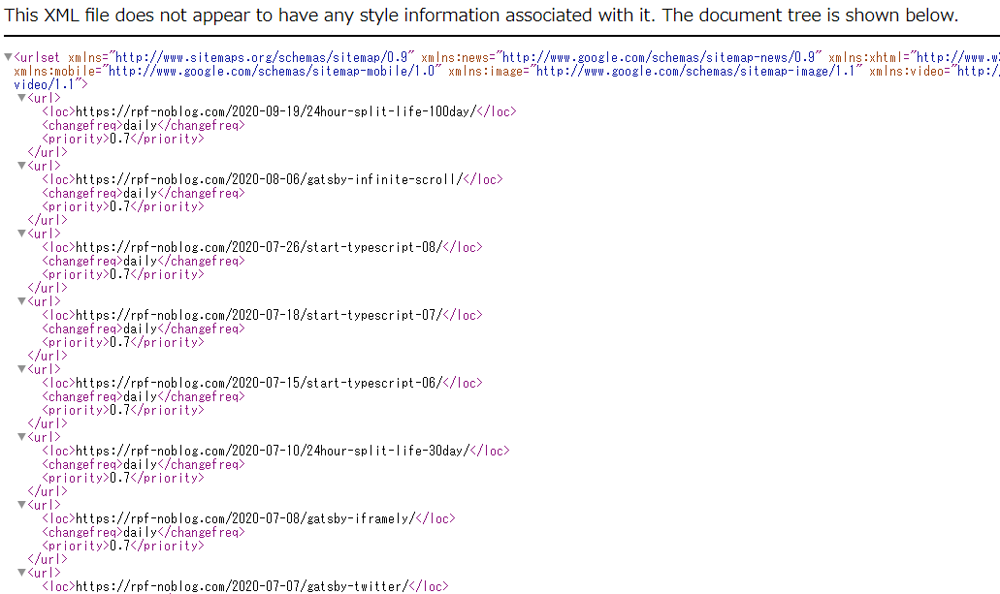
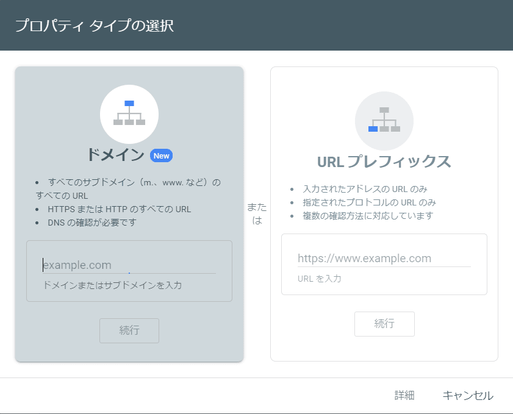
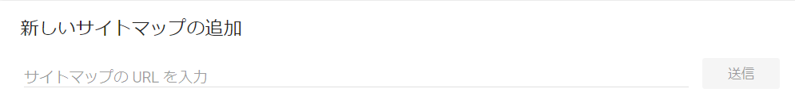

## はじめに

おはようございます！こんにちは！こんばんは！<br>
麻雀と芝生大好きおじさんこと**のふのふ**([@rpf_nob](https://twitter.com/rpf_nob))です！！

せっかく独自ドメインを使用してブログをやっているからには Google 様に自身のサイトを認知してもらいたいですよね！！

ということで今回は GatsbyJS ブログに Sitemap を実装して Google Search Console に登録してみたので解説します！！

- 前提
- Google Search Console とは？
- Google Analytics との違いは？
- パッケージのインストール
- gatsby-config.js の設定
- ビルド
- Google Search Console に登録
- まとめ

## 前提

このブログは GatsbyJS の[gatsby-starter-blog](https://www.gatsbyjs.org/starters/gatsbyjs/gatsby-starter-blog/)のテンプレートから作成しています。

<div class="iframely-embed"><div class="iframely-responsive" style="height: 140px; padding-bottom: 0;"><a href="https://www.gatsbyjs.org/starters/gatsbyjs/gatsby-starter-blog/" data-iframely-url="//cdn.iframe.ly/qjUJkBu?iframe=card-small"></a></div></div>

<br/>

ソースコードはこちら（参考になったという方は ⭐️ をポチッと押してください 🙇‍♂️）

<div class="iframely-embed"><div class="iframely-responsive" style="height: 140px; padding-bottom: 0;"><a href="https://github.com/N-Iwata/noblog" data-iframely-url="//cdn.iframe.ly/Q4tAo8y?card=small"></a></div></div>

## Google Search Console とは？

[公式ページ](https://support.google.com/webmasters/answer/9128668?hl=ja)には以下のように記載されています。

> Google Search Console は、Google 検索結果でのサイトの掲載順位を監視、管理、改善するのに役立つ Google の無料サービスです。Search Console に登録しなくても Google 検索結果にサイトが表示されるようにすることはできますが、Search Console に登録することで、Google のサイトに対する認識を理解し、改善できるようになります。

## Google Analytics との違いは？

自身のサイトを分析して改善するためのツールということは同じですが、違いがあります。

簡単に違いを説明すると Google Analytics は自身のサイトにユーザーが入った後の分析に、Google Search Console は自身のサイトにユーザーが入る前の分析のために使うツールです。

Google Analytics は、どのページを閲覧してどの経路でお問合せなどのゴールまでに辿りついたのかや、どのページがよく閲覧されていてどのページでユーザーが離脱しているのかなどを分析・検証できます。

Google Search Console は、検索結果から自分のサイトがどれくらい来ているか、検索結果ごとにどのくらいの順位なのか。自身のサイトが検索エンジンにどう見えているか、検索順位を下げる可能性がある問題が発生していないかなど分析・検証できます。

## パッケージのインストール

今回は**gatsby-plugin-sitemap**を使って実装します。
基本的には[公式ページ](https://www.gatsbyjs.com/plugins/gatsby-plugin-sitemap/)の内容通りやれば簡単にできます。

```
$npm install --save gatsby-plugin-sitemap
```

<br>

<div class="iframely-embed"><div class="iframely-responsive" style="height: 140px; padding-bottom: 0;"><a href="https://www.gatsbyjs.com/" data-iframely-url="//cdn.iframe.ly/qokMCuD?iframe=card-small"></a></div></div>

## gatsby-config.js の設定

**gatsby-config.js**にインストールしたプラグインを設定します。

siteUrl は元々あったのでそのままですが、プラグインは適当な場所に追加します。

```js:title=gatsby-config.js
module.exports = {
  siteMetadata: {
    url,
    siteUrl: `https://rpf-noblog.com/`,
  },
  plugins:[
      `gatsby-plugin-sitemap`
  ],
},
```

## ビルド

このプラグインは、**production モード**で実行したときにのみ出力を生成するので、サイトマップを確認したい場合は次のコマンドを実行します。

```
$gatsby build && gatsby serve
```

すると production モードで起動するので、**localhost:8000/sitemap.xml**にアクセスして以下のように表示されれば OK です。



確認できたところで、自分の場合は GitHub に push すれば自動で Netlify にデプロイされるので、push して完了です。

## Google Search Console に登録

次の Google Search Console に登録します。
[公式ページ](https://search.google.com/search-console/)にアクセスすると次のような画面になります。



ドメインの方の入力欄に**rpf-noblog.com**を入力（自分のサイトの URL のドメイン部分）して続行します。

続いてドメインの所有権の確認があるのですが、自分の場合は何もしなくてもすぐに確認されました。Google ドメインを使っているからかはわかりませんが、確認されない場合は手順に沿って確認してください。

これで Google Search Console の登録は完了です。

最後にサイトマップを送信します。

以下のように新しいサイトマップの追加から自身のサイトのサイトマップの URL を入力して送信ボタンを押せば完了です。
自分の場合は**https://rpf-noblog.com/sitemap.xml**で送信しました。



次のように表示されていれば正常に処理されたということで設定は完了です。


## まとめ

今回は GatsbyJS ブログに Sitemap を実装して Google Search Console に登録してみたので解説しました！！

せっかく独自ドメインを使用してブログをやっているからには Google 様に自身のサイトを認知してもらいたいですよね！！
これでこのブログに来てくれる人が増えてくれればいいのですが・・・。

他にも GatsbyJS のブログカスタマイズをいろいろやっているので、以下もあわせてご覧いただければと思います。

<div class="iframely-embed"><div class="iframely-responsive" style="height: 140px; padding-bottom: 0;"><a href="https://rpf-noblog.com/tags/gatsby-js/" data-iframely-url="//cdn.iframe.ly/5j7eIPT"></a></div></div>

<br>
<br>

最後まで見ていただきありがとうございます！！
この記事が良かったと思ったら SHARE していただけると泣いて喜びます 🤣
