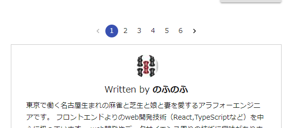

## はじめに

おはようございます！こんにちは！こんばんは！<br>
麻雀と芝生大好きおじさんこと**のふのふ**([@rpf_nob](https://twitter.com/rpf_nob))です！！

記事数が増えてきたこともあって、そろそろページネーションがあったほうがいいかな思ったので実装してみました。

公式ページに追加方法も記載されていますが、今回は**gatsby-awesome-pagination**というパッケージで簡単にできたので、こちらで解説します！！

- 前提
- パッケージのインストール
- templates フォルダ配下に pages/index.js を移動
- gatsby-node.js の編集
- pages/index.js の編集
- components/pagenation.js の作成
- まとめ

## 前提

このブログは GatsbyJS の[gatsby-starter-blog](https://www.gatsbyjs.org/starters/gatsbyjs/gatsby-starter-blog/)のテンプレートから作成しています。

<div class="iframely-embed"><div class="iframely-responsive" style="height: 140px; padding-bottom: 0;"><a href="https://www.gatsbyjs.org/starters/gatsbyjs/gatsby-starter-blog/" data-iframely-url="//cdn.iframe.ly/qjUJkBu?iframe=card-small"></a></div></div>

<br/>

ソースコードはこちら（参考になったという方は ⭐️ をポチッと押していただけると嬉しいです〜 🙇‍♂️）

<div class="iframely-embed"><div class="iframely-responsive" style="height: 140px; padding-bottom: 0;"><a href="https://github.com/N-Iwata/noblog" data-iframely-url="//cdn.iframe.ly/Q4tAo8y?card=small"></a></div></div>

## パッケージのインストール

今回は**gatsby-awesome-pagination**を使って実装します。

```
$npm install --save gatsby-awesome-pagination
```

<br>
こちらのパッケージで簡単にページネーションを実装できます。

<div class="iframely-embed"><div class="iframely-responsive" style="height: 140px; padding-bottom: 0;"><a href="https://www.gatsbyjs.com/" data-iframely-url="//cdn.iframe.ly/57Mzcc6?iframe=card-small"></a></div></div>

## templates フォルダ配下に pages/index.jsx を移動

まず初めに pages/index.jsx を src/templates/homepage フォルダ配下に移動します。

## gatsby-node.js の編集

次にインストールした**gatsby-awesome-pagination**から paginate をインポートします。

```js:title=gatsby-node.js
const { paginate } = require("gatsby-awesome-pagination");
```

そして以下のように、createPages に追記します。

template に先ほど移動した pages/index.js を指定します。

pathPrefix に設定する値で、1 ページ目は **ROOTURL/**で 2 ページ目以降は **ROOTURL/page/2**になるように設定します。

```js{3,19-26}:title=gatsby-node.js
exports.createPages = async ({ graphql, actions }) => {
  const { createPage } = actions;
  const blogPost = path.resolve(`./src/templates/homepage/index.jsx`);

  const result = await graphql(
    `
      {
        posts: allMarkdownRemark(sort: { fields: [frontmatter___date], order: DESC }, limit: 1000) {
          ・・・
      }
    `
  );
  if (result.errors) {
    throw result.errors;
  }

  const posts = result.data.posts.edges;

  paginate({
    createPage,
    items: posts,
    itemsPerPage: 5,
    component: template,
    pathPrefix: ({ pageNumber }) => (pageNumber === 0 ? "/" : "/page"),
  });
```

こちらで gatsby-node.js の編集は完了です。

## src/templates/homepage/index.jsx の編集

次に src/templates/homepage/index.jsx を編集します。

まず始めに pageQuery で skip と limit を取得できるようにします。

```js{2,8-9}:title=src/templates/homepage/index.jsx
export const pageQuery = graphql`
  query($skip: Int!, $limit: Int!) {
    site {
      ・・・
    }
    allMarkdownRemark(
      sort: { fields: [frontmatter___date], order: DESC }
      skip: $skip
      limit: $limit
    ) {
      edges {
        ・・・
      }
    }
  }
`;
```

次にテンプレートのコンポーネントに pageContext がわたってくるので props として受け取り、次で作成する Pagenation コンポーネントを設置して、同じように pageContext を props で渡してあげます。

```js{1,11}:title=src/templates/homepage/index.jsx
const BlogIndex = ({ data, location, pageContext }) => {
  const siteTitle = data.site.siteMetadata.title;
  const author = data.site.siteMetadata.author.name;
  const posts = data.allMarkdownRemark.edges;

  return (
    <div>
      <Layout location={location} title={siteTitle} author={author}>
        <SEO title="All posts" />
        ・・・
        <Pagenation pageContext={pageContext} />
        <Adsense />
        <Adsense />
      </Layout>
    </div>
  );
};
```

## components/pagenation/index.jsx の作成

最後に Pagenation コンポーネントを作成します。

今回は material ui のページネーションコンポーネントを使います。

<div class="iframely-embed"><div class="iframely-responsive" style="height: 140px; padding-bottom: 0;"><a href="https://material-ui.com/components/pagination/" data-iframely-url="//cdn.iframe.ly/7LXFBH0"></a></div></div>

<br>

ソース全文

```js:title=src/components/pagenation/index.jsx
import React from "react";
import { navigate } from "gatsby";
import { makeStyles } from "@material-ui/core/styles";
import { Pagination } from "@material-ui/lab";

const useStyles = makeStyles(theme => ({
  root: {
    display: `flex`,
    flexWrap: `wrap`,
    justifyContent: `center`,
    alignItems: "center",
  },
}));

const Pagenation = ({ pageContext }) => {
  const classes = useStyles();
  const { numberOfPages, humanPageNumber } = pageContext;

  const handleChange = (event, value) => {
    value === 1 ? navigate(`/`) : navigate(`/page/${value}`);
  };
  return (
    <div className={classes.root}>
      <Pagination
        size="small"
        defaultPage={humanPageNumber}
        count={numberOfPages}
        color="primary"
        onChange={handleChange}
      />
    </div>
  );
};
export default Pagenation;
```

pageContext から numberOfPages と humanPageNumber を取り出します。

- numberOfPages は総ページ数
- humanPageNumber は現在のページ番号

material ui の Pagination コンポーネントを設置して以下渡します。

- defaultPage に humanPageNumber を渡す
- count に numberOfPages を渡す
- onChange に handleChange を渡す（後述）

defaultPage を設定してあげないと、ページ遷移時に１ページに目に見た目だけ戻ってしまいます。

handleChange はページ番号クリック時の処理を記載します。

value にページ番号が渡ってくるので、それに対応したページに遷移してあげます。
ページ遷移には gatsby から navigate をインポートしてこちらを使います。react-router の history.push みたいなものです。

これで次のようにページネーションがいい感じに実装できました！！



</div>

## まとめ

今回は**gatsby-awesome-pagination**というパッケージでページネーション実装をしたので方法を解説しました！！

ページネーションがあるとちゃんとしたブログっぽくなりますね。
もっと記事数を増やしてページネーションが意味あるものにしていきたいと思います！！
有用な記事数も増やせるようにしていきたいですね・・・

他にも GatsbyJS のブログカスタマイズをいろいろやっているので、以下もあわせてご覧いただければと思います。

<div class="iframely-embed"><div class="iframely-responsive" style="height: 140px; padding-bottom: 0;"><a href="https://rpf-noblog.com/tags/gatsby-js/" data-iframely-url="//cdn.iframe.ly/5j7eIPT"></a></div></div>

<br>
<br>

最後まで見ていただきありがとうございます！！
この記事が良かったと思ったら SHARE していただけると泣いて喜びます 🤣
