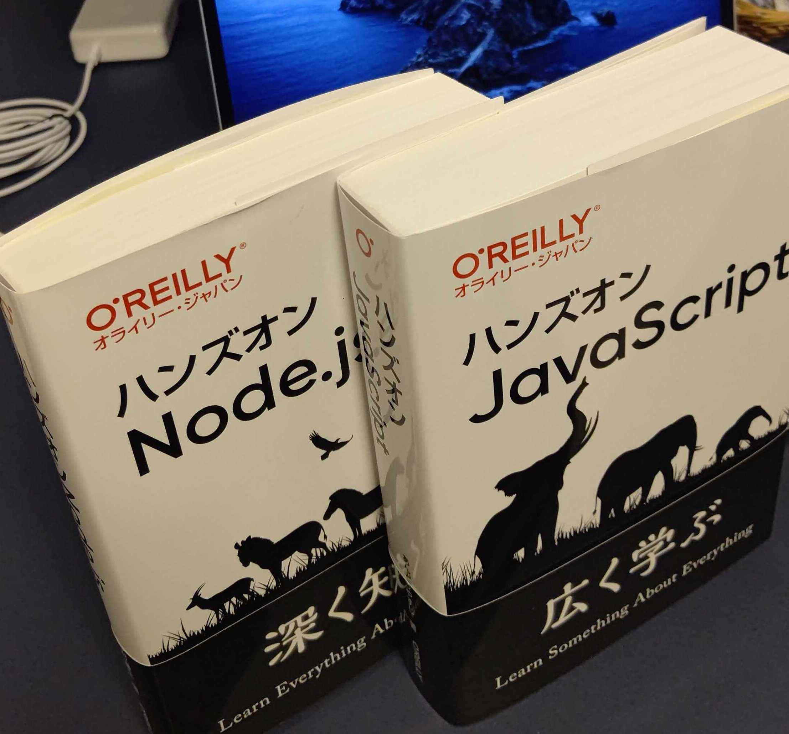

## はじめに

おはようございます！こんにちは！こんばんは！ 
**のふのふ**([@rpf_nob](https://twitter.com/rpf_nob))と申します！！都内のスタートアップでフロントエンドエンジニアとして働いています。

今回は実際に転職ドラフトで自社開発の企業様にフロントエンドエンジニアとして転職したので、感想を記事に書いてみたいと思います。

この記事を読むだけで転職ドラフトのメリットが伝わると思いますし、誰か役に立てれば幸いですので興味あれば読んで見てください 😃

※トップ画像は公式サイトから拝借しておりましたが、商標権に関して問題ありと指摘受けましたので変更致しました。御詫び申し上げます。

## 前提

[[info]]
| こちらの記事は転職ドラフト体験談投稿キャンペーンに参加しています。

https://job-draft.jp/articles/251

## スペックと経歴

簡単にスペックと経歴を書くと以下のような感じです。

- 30 代後半で妻と娘の 3 人家族
- 埼玉県在住
- 国立大理系学部卒（6 年かけて・・・）
- 新卒扱いでスタートアップのパチスロ開発会社入社（約 4 年）
- 中途で遊技機大手メーカー入社（約 9 年）
- 基本的にパチスロのソフト開発のエンジニアとして勤務
- 2019 年から新設部署で機械学習や web 開発中心の業務に社内ジョブチェンジ
- 直近 1 年くらいは React と Nodejs での SPA+API という方式の社内向け web アプリケーションを開発・運用
- React が好きになったのでフロントエンドを中心とした web 系エンジニアを目指した

## 転職ドラフトに登録したきっかけ

Twitter でフォローしている方が転職ドラフトに参加されていて、実際に指名されたツイートをしているのを見て、おもしろそうと思って登録しました。

指名されてもされなくても自分の市場価値を知るいい機会であるし、少なからず web 開発を本業にできるような会社に転職したいという気持ちもあったというのもきっかけになります。

## 転職ドラフトでの指名状況

計 4 回参加しました。
指名状況は以下の通りです。

- 1 回目：指名 1😃（技術面接で選考落ち 😢）
- 2 回目：指名 0😭
- 3 回目：指名 1😃（こちらにお世話になってます）
- 4 回目：指名 2🤣（カジュアル面談のみで選考辞退）

全て React(Next.js)と TypeScript をメインで使用している企業様から、レジュメに希望職種として記載していたフロントエンドエンジニアとしての指名でした。

30 代後半で web 開発関連の業務を約 1 年しか経験していない自分に指名が入ることはあまり想定していなかったので、指名が入った時は純粋にかなりうれしかったです 🤣

基本的に私自身が優良な経歴ではないので、指名は全て最終日でした。まあ、他の方の指名状況を見ても最終日が一番指名が来ているので最後まで待っていればいいかなと思います。

## 面接で感じたこと

基本的に面接は通常のものと変わらないです。ただ、指名頂いているということもあり、書類選考はなく面接までは辿り着けます。

はじめは「ドラフトで指名＝ほぼ採用」というイメージをもってしまっていたので、準備不足もあり 1 社目の技術面接はボロボロになってしまいました 😭

なので、「指名＝書類選考通過」くらいのイメージをもっておくと良いかと思います。

企業ごとにすべてオンラインで選考ができるかの情報も企業情報に記載されてましたし、コロナ渦ということもあり実際に全てオンラインでの面接でした。

[[warn]]
| 野球のドラフトのように「指名」＝「内定」ではないので注意！！

## 転職ドラフトをやってよかったこと

### レジュメを無料でレビューしてくれる

レジュメを無料でレビューしていただけるところはものすごくありがたかったです。他の転職媒体ではあまりないサービスだと思うので、とりあえず登録してレジュメ審査を受けてみるだけでも価値があると思いました。実際には「どういった工夫をしたのか、どういったことを解決していたか」などを書くように指摘をもらったりしました。

### 他のユーザーの経歴や考え方を知れる

他のユーザーの経歴を見れるのも他ではないと思うので良いですね。どういった経験・技術・考え方を持っている人が多数指名・高額指名されているかなどわかるので、キャリア戦略にも使えると思いました。

[[info]]
| 他のユーザーのレジュメは基本的には技術スタックだけ見れますが、すべて参照できるユーザーもいます。

### 事前に年収を知れる

指名時に内定時の年収をおおよそ（90%ルール）知ることができ、希望年収に満たない場合に辞退することで不要な選考に進まない選択ができるので、フル出社で仕事しながら転職活動していて時間捻出することがかなり大変だった私にとってはものすごくありがたかったです。

[[info]]
| 90%ルールは内定時年収が指名時年収の 90%以上にしないといけないルールのことです。

## 転職ドラフトへの改善要望

### 90%ルールを使っている企業をわかるようにしたほうがいい

実際に内定時に指名時の年収から 90%ギリギリまで下げられてしまった場合に結構もやもやすると思うので、初めから企業ごとに指名時の年収と内定年収の分布などがわかるとユーザーとしてはうれしいかと思いました。

ちなみに私は指名時の年収のまま内定をいただきましたが、内定後の人事の方との面談をするまでドキドキしてましたし、90%まで下げられた場合に内定を受諾するか少し迷っていました。

### 面談日程の調整機能を複数日指定できない

面談日程を一気に複数回決めたい時に、複数日を指定できないようになっていたので、できたら改善していただいたほうがいいかと思いました。もしくは 1 日しか指定できないという注意書きがあってもよいかと思います。

## 転職ドラフトを使ったことがない方へのメッセージ

自身の市場価値を知るいい機会だと思うので、積極的に転職する気がなくても登録して参加しておくのをおススメします 👍

職務経歴の棚卸にもなりますし、他の方の経歴をみることで**今後のキャリアの方向性**を考えるきっかけにもなります。

また、思いもしない**メガベンチャーのような企業**から指名がいただけるかもしれません。

あと、レジュメには会社の業務以外の個人的なものを書いても問題ないらしいので、**業務未経験の方でも個人でサービスを開発・運用**していればレジュメを書ける（2 つ必要ですが）ので登録できると思います。

## 転職ドラフトを登録したい人へ

転職ドラフトに登録して、友達紹介コード「**LNAT**」を入力してレジュメの審査を通過して 1 回ドラフトに参加すれば、以下のプレゼント（2021 年 6 月 7 日現在）を 1 個もらえますのでよろしければ使ってみてください。紹介した人、された人両方もらえます 😃

- お好きな O’REILLY JAPAN の本（税抜 5000 円以内）を 1 冊
- ACTUS ギフトカタログ Y_O／イエローオーカー
- DNS プロテインホエイ 100 1kg
- 転職ドラフトオリジナル ドラフトビール 6 本入り
- COMP 5000 円分
- Amazon ギフト券 3000 円分

他にも**転職成功時**や**体験談をブログ等に投稿すること**でプレゼントをもらえるのもありますので興味ある方はどうぞ！！

 
 

下の画像は過去２回友達紹介コードを使用していただいたのでその戦利品です。

追記：3 回目いただきました 🙏

## まとめ

今回は実際に転職ドラフトで自社開発の企業様にフロントエンドエンジニアとして転職したので、感想を記事に書いてみました。

転職ドラフトに登録してレジュメ書いてドラフトに参加しておくだけでも価値があると思いますので、是非参加してみてください。

 
 

最後まで読んでいただきありがとうございます！！
この記事が良かったと思ったら SHARE していただけると泣いて喜びます 🤣
