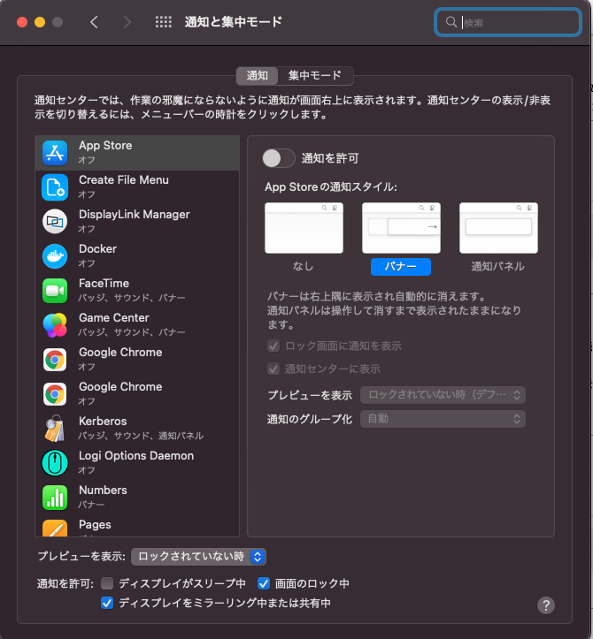

## はじめに

おはようございます！こんにちは！こんばんは！ 
**のふのふ**([@rpf_nob](https://twitter.com/rpf_nob))と申します！！都内のスタートアップでフロントエンドエンジニアとして働いています。

今回は以下条件の場合に Slack 等の通知がこなくなる現象があり、調べたところとりあえず対処できたので、その方法をまとめておきます。

- 13 インチ M1 MacBook Pro(2020)
- OS は Monterey(12.2.1)
- 1 台は通常接続、DisplayLink でもう 1 台外部ディスプレイを接続

## DisplayLink とは

13 インチ M1 MacBook Pro(2020) はデフォルトでは外部モニターに 1 台しか接続できません。

でも 2 台以上のディスプレイを接続して、デュアルディスプレイにしたいですよね。

そこで DisplayLink という規格を用いることで２台以上の外部ディスプレイを接続することが可能となります。

DisplayLink での外部ディスプレイ２台以上接続については、「m1mac display 2 台」のような感じで検索してもらえばたくさん記事があるのでそちらを参考にしていただければと思います。

筆者は以下の記事を参考にしたので、DisplayLink 対応 USB ドックも同じものを使用しています。

https://dev.classmethod.jp/articles/using-vertical-display-when-connected-to-displaylink-in-m1-mac-book-air/

## 対処法

「システム環境設定」を開き、「通知と集中モード」を開きます。

すると以下の画像のような設定画面が開くと思います。

ここの一番下にある、「**通知を許可: ディスプレイをミラーリング中または共有中**」のチェックを入れてください。

チェックを入れたら確認してください。

Slack で確認する場合は、「環境設定」を開いて「通知」を選択して、「サウンド＆表示」の「例を表示する」をクリックすれば、通知のサンプルがでますのでこちらで確認すると良いでしょう。

## 今後

MontereyOS のアップデートや DisplayLink の方で対処されるかもしれませんが、今のところはこれが一番の対処法のようです。

何かしら発展があったら追記したいと思います。

## 参考

https://displaylink.org/forum/showthread.php?p=92979#post92979

## まとめ

今回は、M1mac(Monterey)を DisplayLink でデュアルモニターにした時に、Slack 等の通知がこなくなった時の対処法についてまとめました。

ようやくデュアルディスプレイ（35 インチウルトラワイド+24 インチ縦置き）を実現できたと思ったら Slack の通知がこなくなったので、これが対処できなかったら相当悲しかったので、対処できてよかったです。

同じような境遇の人がこちらの記事によって解決することができれば幸いです。

 
 

最後まで読んでいただきありがとうございます！！
この記事が良かったと思ったら SHARE していただけると泣いて喜びます 🤣
